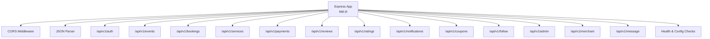
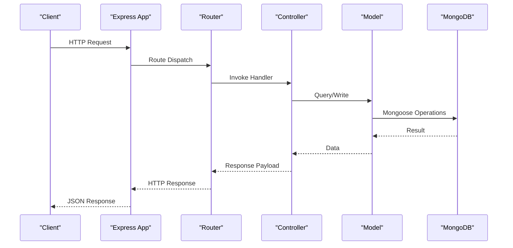
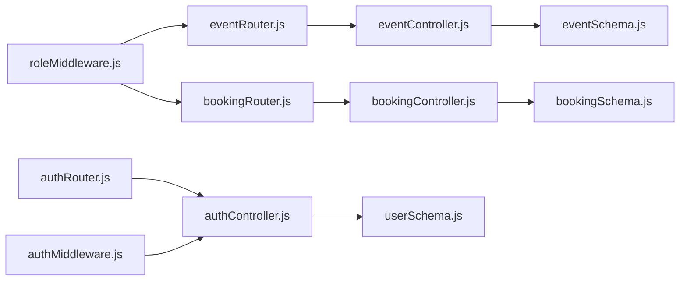

# API Reference

<cite>
**Referenced Files in This Document**
- [app.js](file://backend/app.js)
- [server.js](file://backend/server.js)
- [package.json](file://backend/package.json)
- [authRouter.js](file://backend/router/authRouter.js)
- [authController.js](file://backend/controller/authController.js)
- [authMiddleware.js](file://backend/middleware/authMiddleware.js)
- [userSchema.js](file://backend/models/userSchema.js)
- [eventRouter.js](file://backend/router/eventRouter.js)
- [eventController.js](file://backend/controller/eventController.js)
- [eventSchema.js](file://backend/models/eventSchema.js)
- [bookingRouter.js](file://backend/router/bookingRouter.js)
- [bookingController.js](file://backend/controller/bookingController.js)
- [bookingSchema.js](file://backend/models/bookingSchema.js)
- [paymentsRouter.js](file://backend/router/paymentsRouter.js)
- [paymentController.js](file://backend/controller/paymentController.js)
- [paymentSchema.js](file://backend/models/paymentSchema.js)
- [couponRouter.js](file://backend/router/couponRouter.js)
- [couponController.js](file://backend/controller/couponController.js)
- [couponSchema.js](file://backend/models/couponSchema.js)
- [reviewRouter.js](file://backend/router/reviewRouter.js)
- [reviewController.js](file://backend/controller/reviewController.js)
- [ratingRouter.js](file://backend/router/ratingRouter.js)
- [ratingController.js](file://backend/controller/ratingController.js)
- [followRouter.js](file://backend/router/followRouter.js)
- [followController.js](file://backend/controller/followController.js)
- [followSchema.js](file://backend/models/followSchema.js)
- [notificationRouter.js](file://backend/router/notificationRouter.js)
- [messageRouter.js](file://backend/router/messageRouter.js)
- [adminRouter.js](file://backend/router/adminRouter.js)
- [adminController.js](file://backend/controller/adminController.js)
- [merchantRouter.js](file://backend/router/merchantRouter.js)
- [merchantController.js](file://backend/controller/merchantController.js)
- [serviceRouter.js](file://backend/router/serviceRouter.js)
- [serviceController.js](file://backend/controller/serviceController.js)
- [serviceSchema.js](file://backend/models/serviceSchema.js)
</cite>

## Table of Contents
1. [Introduction](#introduction)
2. [Project Structure](#project-structure)
3. [Core Components](#core-components)
4. [Architecture Overview](#architecture-overview)
5. [Detailed Component Analysis](#detailed-component-analysis)
6. [Dependency Analysis](#dependency-analysis)
7. [Performance Considerations](#performance-considerations)
8. [Troubleshooting Guide](#troubleshooting-guide)
9. [Conclusion](#conclusion)
10. [Appendices](#appendices)

## Introduction
This document provides comprehensive API documentation for the MERN Stack Event Management Platform. It covers all endpoint groups, HTTP methods, URL patterns, request/response schemas, authentication requirements, and error responses. It also documents API versioning, rate limiting, integration patterns, and client implementation guidelines.

## Project Structure
The backend exposes REST endpoints under the base path /api/v1. Each functional area is mounted under a dedicated route group. Authentication is enforced via a Bearer token JWT strategy.

**Diagram sources**
- [app.js:35-62](file://backend/app.js#L35-L62)

**Section sources**
- [app.js:24-47](file://backend/app.js#L24-L47)
- [server.js:1-6](file://backend/server.js#L1-L6)
- [package.json:1-30](file://backend/package.json#L1-L30)

## Core Components
- API Versioning: All routes are prefixed with /api/v1.
- Authentication: JWT via Authorization: Bearer <token>.
- Roles: user, merchant, admin. Role guards apply per endpoint.
- CORS: Enabled for configured frontend origin with credentials support.
- Rate Limiting: Not implemented in the current codebase; see Troubleshooting Guide for recommendations.

**Section sources**
- [app.js:24-30](file://backend/app.js#L24-L30)
- [authMiddleware.js:1-17](file://backend/middleware/authMiddleware.js#L1-L17)
- [userSchema.js:39-44](file://backend/models/userSchema.js#L39-L44)

## Architecture Overview
High-level API flow: client → Express app → router → controller → model(s) → MongoDB.

**Diagram sources**
- [app.js:35-47](file://backend/app.js#L35-L47)
- [authRouter.js:1-12](file://backend/router/authRouter.js#L1-L12)
- [authController.js:11-120](file://backend/controller/authController.js#L11-L120)

## Detailed Component Analysis

### Authentication API
- Base Path: /api/v1/auth
- Methods and Endpoints:
  - POST /register
    - Description: Registers a new user.
    - Auth: None
    - Request Body: name, email, password, role (optional; defaults to user)
    - Responses:
      - 201: success, message, token, user
      - 400: validation error
      - 409: user exists
      - 500: unknown error
  - POST /login
    - Description: Logs in an existing user.
    - Auth: None
    - Request Body: email, password
    - Responses:
      - 200: success, message, token, user
      - 400: missing fields
      - 401: invalid credentials
      - 500: server error
  - GET /me
    - Description: Fetches currently authenticated user profile.
    - Auth: Required (Bearer)
    - Responses:
      - 200: success, user
      - 404: user not found
      - 401: unauthorized
      - 500: unknown error

- Validation Rules:
  - Name: required, min length 3
  - Email: required, unique, valid format
  - Password: required, min length 6
  - Role: enum ["user", "admin", "merchant"]

- Example Requests/Responses:
  - POST /api/v1/auth/register
    - Request: {"name":"Alex","email":"alex@example.com","password":"pass123","role":"user"}
    - Response: {"success":true,"message":"Registration successful","token":"<jwt>","user":{"id":"...","name":"Alex","email":"alex@example.com","role":"user"}}
  - POST /api/v1/auth/login
    - Request: {"email":"alex@example.com","password":"pass123"}
    - Response: {"success":true,"message":"Login successful","token":"<jwt>","user":{"id":"...","name":"Alex","email":"alex@example.com","role":"user"}}

**Section sources**
- [authRouter.js:7-9](file://backend/router/authRouter.js#L7-L9)
- [authController.js:11-120](file://backend/controller/authController.js#L11-L120)
- [authMiddleware.js:1-17](file://backend/middleware/authMiddleware.js#L1-L17)
- [userSchema.js:6-50](file://backend/models/userSchema.js#L6-L50)

### User Management API
- Base Path: /api/v1/auth
- Methods and Endpoints:
  - GET /me
    - Description: See Authentication API section.

- Notes:
  - Additional user CRUD endpoints are not present in the current codebase. Use /auth/me for profile retrieval.

**Section sources**
- [authRouter.js:9](file://backend/router/authRouter.js#L9)
- [authController.js:109-119](file://backend/controller/authController.js#L109-L119)

### Event Management API
- Base Path: /api/v1/events
- Methods and Endpoints:
  - GET /
    - Description: Lists all events.
    - Auth: None
    - Responses:
      - 200: success, events[]
      - 500: unknown error
  - POST /:id/register
    - Description: Registers the authenticated user for an event.
    - Auth: Required (Bearer, role=user)
    - Path Params: id (Event ID)
    - Responses:
      - 201: success, message
      - 404: event not found
      - 409: already registered
      - 500: unknown error
  - GET /me
    - Description: Lists the authenticated user’s event registrations.
    - Auth: Required (Bearer, role=user)
    - Responses:
      - 200: success, registrations[]
      - 500: unknown error

- Validation Rules:
  - Event fields: title required; images array requires public_id and url; rating 0–5

- Example Requests/Responses:
  - POST /api/v1/events/673421342134213421342134/register
    - Response: {"success":true,"message":"Registered successfully"}

**Section sources**
- [eventRouter.js:8-10](file://backend/router/eventRouter.js#L8-L10)
- [eventController.js:4-34](file://backend/controller/eventController.js#L4-L34)
- [eventSchema.js:5-20](file://backend/models/eventSchema.js#L5-L20)

### Booking System API
- Base Path: /api/v1/bookings
- Methods and Endpoints:
  - POST /
    - Description: Creates a new booking for a service.
    - Auth: Required (Bearer)
    - Request Body: serviceId*, serviceTitle*, serviceCategory*, servicePrice*, eventDate, notes, guestCount
    - Responses:
      - 201: success, message, booking
      - 400: missing required fields
      - 409: active booking exists for service
      - 500: failed to create booking
  - GET /my-bookings
    - Description: Retrieves all bookings for the authenticated user.
    - Auth: Required (Bearer)
    - Responses:
      - 200: success, bookings[]
      - 500: failed to fetch bookings
  - GET /:id
    - Description: Retrieves a booking by ID owned by the authenticated user.
    - Auth: Required (Bearer)
    - Path Params: id
    - Responses:
      - 200: success, booking
      - 404: booking not found
      - 500: failed to fetch booking
  - PUT /:id/cancel
    - Description: Cancels an existing booking (if eligible).
    - Auth: Required (Bearer)
    - Path Params: id
    - Responses:
      - 200: success, message, booking
      - 400: already cancelled or completed
      - 404: booking not found
      - 500: failed to cancel booking
  - GET /admin/all
    - Description: Lists all bookings (admin only).
    - Auth: Required (Bearer, role=admin)
    - Responses:
      - 200: success, bookings[]
      - 500: failed to fetch bookings
  - PUT /admin/:id/status
    - Description: Updates booking status (admin only).
    - Auth: Required (Bearer, role=admin)
    - Path Params: id
    - Request Body: status (enum: pending, confirmed, cancelled, completed)
    - Responses:
      - 200: success, message, booking
      - 400: invalid status
      - 404: booking not found
      - 500: failed to update booking

- Validation Rules:
  - Status enum: ["pending","confirmed","cancelled","completed"]
  - Guest count default: 1
  - Total price computed as servicePrice * guestCount

- Example Requests/Responses:
  - POST /api/v1/bookings/
    - Request: {"serviceId":"svc1","serviceTitle":"Service A","serviceCategory":"Category X","servicePrice":100,"eventDate":"2025-12-25T00:00:00Z","notes":"Please arrive early","guestCount":4}
    - Response: {"success":true,"message":"Booking created successfully","booking":{...}}

**Section sources**
- [bookingRouter.js:15-23](file://backend/router/bookingRouter.js#L15-L23)
- [bookingController.js:4-232](file://backend/controller/bookingController.js#L4-L232)
- [bookingSchema.js:5-50](file://backend/models/bookingSchema.js#L5-L50)

### Merchant Operations API
- Base Path: /api/v1/merchant
- Available Endpoints:
  - No explicit merchant endpoints are defined in the current codebase. Integrate merchant-specific routes by adding handlers to the merchant router and controllers.

- Notes:
  - Merchant dashboards and related features are present in the frontend; backend endpoints are not implemented yet.

**Section sources**
- [merchantRouter.js](file://backend/router/merchantRouter.js)

### Admin Functions API
- Base Path: /api/v1/admin
- Available Endpoints:
  - No explicit admin endpoints are defined in the current codebase. Integrate admin-specific routes by adding handlers to the admin router and controllers.

- Notes:
  - Admin dashboards and analytics are present in the frontend; backend endpoints are not implemented yet.

**Section sources**
- [adminRouter.js](file://backend/router/adminRouter.js)

### Service Management API
- Base Path: /api/v1/services
- Methods and Endpoints:
  - GET / (placeholder)
  - POST / (placeholder)
  - PUT /:id (placeholder)
  - DELETE /:id (placeholder)

- Notes:
  - Service endpoints are placeholders. Implement handlers in serviceRouter.js and serviceController.js.

**Section sources**
- [serviceRouter.js](file://backend/router/serviceRouter.js)

### Payments API
- Base Path: /api/v1/payments
- Methods and Endpoints:
  - POST / (placeholder)
  - GET / (placeholder)
  - GET /:id (placeholder)

- Notes:
  - Payment endpoints are placeholders. Implement handlers in paymentsRouter.js and paymentController.js.

**Section sources**
- [paymentsRouter.js](file://backend/router/paymentsRouter.js)

### Reviews and Ratings API
- Base Path: /api/v1/reviews
- Methods and Endpoints:
  - GET / (placeholder)
  - POST / (placeholder)
  - PUT /:id (placeholder)
  - DELETE /:id (placeholder)

- Base Path: /api/v1/ratings
- Methods and Endpoints:
  - GET / (placeholder)
  - POST / (placeholder)
  - PUT /:id (placeholder)
  - DELETE /:id (placeholder)

- Notes:
  - Review and rating endpoints are placeholders. Implement handlers in reviewRouter.js/reviewController.js and ratingRouter.js/ratingController.js.

**Section sources**
- [reviewRouter.js](file://backend/router/reviewRouter.js)
- [ratingRouter.js](file://backend/router/ratingRouter.js)

### Coupons API
- Base Path: /api/v1/coupons
- Methods and Endpoints:
  - GET / (placeholder)
  - POST / (placeholder)
  - PUT /:id (placeholder)
  - DELETE /:id (placeholder)

- Notes:
  - Coupon endpoints are placeholders. Implement handlers in couponRouter.js and couponController.js.

**Section sources**
- [couponRouter.js](file://backend/router/couponRouter.js)

### Social Features API
- Base Path: /api/v1/follow
- Methods and Endpoints:
  - POST / (placeholder)
  - DELETE /:id (placeholder)
  - GET / (placeholder)

- Base Path: /api/v1/notifications
- Methods and Endpoints:
  - GET / (placeholder)
  - POST / (placeholder)
  - DELETE /:id (placeholder)

- Base Path: /api/v1/message
- Methods and Endpoints:
  - GET / (placeholder)
  - POST / (placeholder)
  - DELETE /:id (placeholder)

- Notes:
  - Social endpoints are placeholders. Implement handlers in followRouter.js/followController.js, notificationRouter.js, and messageRouter.js.

**Section sources**
- [followRouter.js](file://backend/router/followRouter.js)
- [notificationRouter.js](file://backend/router/notificationRouter.js)
- [messageRouter.js](file://backend/router/messageRouter.js)

## Dependency Analysis
- Router-to-Controller coupling: Each router delegates to a single controller module.
- Controller-to-Model coupling: Controllers operate on Mongoose models.
- Middleware: authMiddleware enforces JWT; roleMiddleware restricts endpoints by role.
- External integrations: Cloudinary configuration exposed via a health endpoint.

**Diagram sources**
- [authRouter.js:1-12](file://backend/router/authRouter.js#L1-L12)
- [authController.js:11-120](file://backend/controller/authController.js#L11-L120)
- [eventRouter.js:1-13](file://backend/router/eventRouter.js#L1-L13)
- [eventController.js:1-35](file://backend/controller/eventController.js#L1-L35)
- [bookingRouter.js:1-26](file://backend/router/bookingRouter.js#L1-L26)
- [bookingController.js:1-233](file://backend/controller/bookingController.js#L1-L233)
- [authMiddleware.js:1-17](file://backend/middleware/authMiddleware.js#L1-L17)
- [userSchema.js:1-55](file://backend/models/userSchema.js#L1-L55)
- [eventSchema.js:1-23](file://backend/models/eventSchema.js#L1-L23)
- [bookingSchema.js:1-53](file://backend/models/bookingSchema.js#L1-L53)

**Section sources**
- [app.js:4-18](file://backend/app.js#L4-L18)

## Performance Considerations
- Indexing: Add database indexes on frequently queried fields (e.g., Booking.user, Booking.serviceId, User.email).
- Pagination: Implement pagination for listing endpoints (events, bookings, reviews).
- Caching: Cache static assets and infrequently changing data (e.g., event categories).
- Connection pooling: Ensure MongoDB connection pool settings are tuned for production load.
- Payload sizes: Avoid returning large nested documents; use selective population and projections.

## Troubleshooting Guide
- Health Check: GET /api/v1/health returns {"status":"ok"}.
- Config Check: GET /api/v1/config-check reports Cloudinary configuration status.
- CORS Issues: Verify FRONTEND_URL in environment variables matches the origin sending requests.
- Rate Limiting: Not implemented; consider adding a rate limiter middleware to protect endpoints.
- JWT Errors: Ensure JWT_SECRET is set and consistent across deployments; verify token format Authorization: Bearer <token>.

**Section sources**
- [app.js:49-62](file://backend/app.js#L49-L62)
- [authMiddleware.js:1-17](file://backend/middleware/authMiddleware.js#L1-L17)

## Conclusion
This API reference documents the current state of the backend, focusing on authentication, events, and bookings. Additional endpoint groups (merchant, admin, services, payments, coupons, reviews/ratings, social features) are placeholders and require implementation. Follow the provided patterns to integrate new endpoints securely and consistently.

## Appendices

### API Versioning
- All endpoints are prefixed with /api/v1.

**Section sources**
- [app.js:35-47](file://backend/app.js#L35-L47)

### Authentication and Authorization
- JWT Bearer tokens are required for protected endpoints.
- Role-based access control applies to specific routes.

**Section sources**
- [authMiddleware.js:1-17](file://backend/middleware/authMiddleware.js#L1-L17)
- [userSchema.js:39-44](file://backend/models/userSchema.js#L39-L44)

### Client Implementation Guidelines
- Set Authorization header to Bearer <token> for authenticated requests.
- Use HTTPS in production.
- Handle 401 Unauthorized by prompting re-login.
- Implement retry with exponential backoff for transient 5xx errors.
- Validate response shapes against documented schemas.

### Common Usage Scenarios
- New user registration and login
- Browse events and register for an event
- Create a booking for a service
- View and cancel personal bookings
- Admin views all bookings and updates statuses