# Booking and Payment System

<cite>
**Referenced Files in This Document**
- [bookingSchema.js](file://backend/models/bookingSchema.js)
- [paymentSchema.js](file://backend/models/paymentSchema.js)
- [bookingController.js](file://backend/controller/bookingController.js)
- [eventBookingController.js](file://backend/controller/eventBookingController.js)
- [paymentController.js](file://backend/controller/paymentController.js)
- [bookingRouter.js](file://backend/router/bookingRouter.js)
- [eventBookingRouter.js](file://backend/router/eventBookingRouter.js)
- [paymentsRouter.js](file://backend/router/paymentsRouter.js)
- [BookingModal.jsx](file://frontend/src/components/BookingModal.jsx)
- [EventBookingModal.jsx](file://frontend/src/components/EventBookingModal.jsx)
- [PaymentModal.jsx](file://frontend/src/components/PaymentModal.jsx)
- [TicketSelectionModal.jsx](file://frontend/src/components/TicketSelectionModal.jsx)
- [ServiceBookingModal.jsx](file://frontend/src/components/ServiceBookingModal.jsx)
- [ServicePaymentModal.jsx](file://frontend/src/components/ServicePaymentModal.jsx)
</cite>

## Table of Contents
1. [Introduction](#introduction)
2. [Project Structure](#project-structure)
3. [Core Components](#core-components)
4. [Architecture Overview](#architecture-overview)
5. [Detailed Component Analysis](#detailed-component-analysis)
6. [Dependency Analysis](#dependency-analysis)
7. [Performance Considerations](#performance-considerations)
8. [Troubleshooting Guide](#troubleshooting-guide)
9. [Conclusion](#conclusion)

## Introduction
This document provides comprehensive documentation for the Event Management Platform's booking and payment system. It covers the booking workflow implementation, service-based booking processes, ticketed event booking, payment processing integration, and booking status management. The documentation also details the booking schema design, payment gateway integration, refund and cancellation handling, booking confirmation processes, and the user interaction patterns through modals and dialogs.

## Project Structure
The booking and payment system spans both backend and frontend components:
- Backend: Models define the booking and payment schemas, controllers implement the business logic, and routers expose the API endpoints.
- Frontend: Modals and dialogs manage user interactions for booking creation, payment processing, and coupon application.

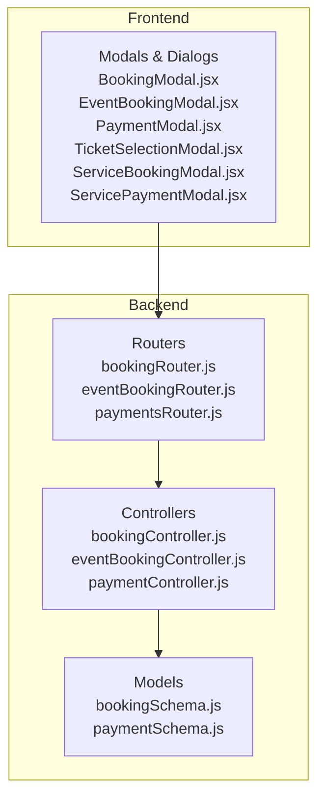

**Diagram sources**
- [bookingSchema.js:1-53](file://backend/models/bookingSchema.js#L1-L53)
- [paymentSchema.js:1-142](file://backend/models/paymentSchema.js#L1-L142)
- [bookingController.js:1-233](file://backend/controller/bookingController.js#L1-L233)
- [eventBookingController.js:1-800](file://backend/controller/eventBookingController.js#L1-L800)
- [paymentController.js:1-577](file://backend/controller/paymentController.js#L1-L577)
- [bookingRouter.js:1-26](file://backend/router/bookingRouter.js#L1-L26)
- [eventBookingRouter.js:1-47](file://backend/router/eventBookingRouter.js#L1-L47)
- [paymentsRouter.js:1-44](file://backend/router/paymentsRouter.js#L1-L44)
- [BookingModal.jsx:1-317](file://frontend/src/components/BookingModal.jsx#L1-L317)
- [EventBookingModal.jsx:1-276](file://frontend/src/components/EventBookingModal.jsx#L1-L276)
- [PaymentModal.jsx:1-206](file://frontend/src/components/PaymentModal.jsx#L1-L206)
- [TicketSelectionModal.jsx:1-448](file://frontend/src/components/TicketSelectionModal.jsx#L1-L448)
- [ServiceBookingModal.jsx:1-440](file://frontend/src/components/ServiceBookingModal.jsx#L1-L440)
- [ServicePaymentModal.jsx:1-246](file://frontend/src/components/ServicePaymentModal.jsx#L1-L246)

**Section sources**
- [bookingSchema.js:1-53](file://backend/models/bookingSchema.js#L1-L53)
- [paymentSchema.js:1-142](file://backend/models/paymentSchema.js#L1-L142)
- [bookingController.js:1-233](file://backend/controller/bookingController.js#L1-L233)
- [eventBookingController.js:1-800](file://backend/controller/eventBookingController.js#L1-L800)
- [paymentController.js:1-577](file://backend/controller/paymentController.js#L1-L577)
- [bookingRouter.js:1-26](file://backend/router/bookingRouter.js#L1-L26)
- [eventBookingRouter.js:1-47](file://backend/router/eventBookingRouter.js#L1-L47)
- [paymentsRouter.js:1-44](file://backend/router/paymentsRouter.js#L1-L44)
- [BookingModal.jsx:1-317](file://frontend/src/components/BookingModal.jsx#L1-L317)
- [EventBookingModal.jsx:1-276](file://frontend/src/components/EventBookingModal.jsx#L1-L276)
- [PaymentModal.jsx:1-206](file://frontend/src/components/PaymentModal.jsx#L1-L206)
- [TicketSelectionModal.jsx:1-448](file://frontend/src/components/TicketSelectionModal.jsx#L1-L448)
- [ServiceBookingModal.jsx:1-440](file://frontend/src/components/ServiceBookingModal.jsx#L1-L440)
- [ServicePaymentModal.jsx:1-246](file://frontend/src/components/ServicePaymentModal.jsx#L1-L246)

## Core Components
This section outlines the core components involved in the booking and payment system.

- Booking Schema: Defines the structure for service bookings, including user reference, service details, booking date, event date, notes, status, guest count, and total price.
- Payment Schema: Defines the structure for payment records, including user and merchant references, booking reference, event reference, amounts, payment status, payment method, transaction identifiers, refund details, payout status, and metadata.
- Booking Controller: Manages CRUD operations for bookings, user-specific retrieval, cancellation, and admin-level status updates.
- Event Booking Controller: Handles event-specific booking workflows, routing between full-service and ticketed booking types, coupon application, capacity management, and merchant approvals.
- Payment Controller: Processes payments, handles refunds, retrieves payment statistics, and manages merchant earnings.
- Frontend Modals: Provide user interfaces for booking creation, payment selection, and coupon application across service and ticketed events.

**Section sources**
- [bookingSchema.js:1-53](file://backend/models/bookingSchema.js#L1-L53)
- [paymentSchema.js:1-142](file://backend/models/paymentSchema.js#L1-L142)
- [bookingController.js:1-233](file://backend/controller/bookingController.js#L1-L233)
- [eventBookingController.js:1-800](file://backend/controller/eventBookingController.js#L1-L800)
- [paymentController.js:1-577](file://backend/controller/paymentController.js#L1-L577)

## Architecture Overview
The system follows a layered architecture with clear separation between frontend modals and backend controllers. The frontend modals collect user input and submit requests to backend endpoints, which enforce business rules, update database records, and notify stakeholders via notifications.

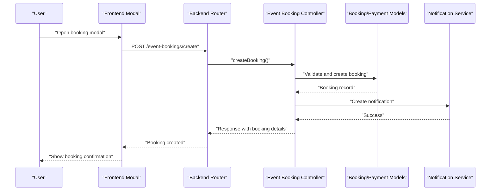

**Diagram sources**
- [eventBookingRouter.js:1-47](file://backend/router/eventBookingRouter.js#L1-L47)
- [eventBookingController.js:1-800](file://backend/controller/eventBookingController.js#L1-L800)
- [bookingSchema.js:1-53](file://backend/models/bookingSchema.js#L1-L53)
- [paymentSchema.js:1-142](file://backend/models/paymentSchema.js#L1-L142)

## Detailed Component Analysis

### Booking Schema Design
The booking schema captures essential booking attributes and maintains referential integrity with users, services, and events. It supports four booking statuses: pending, confirmed, cancelled, and completed, enabling lifecycle management.

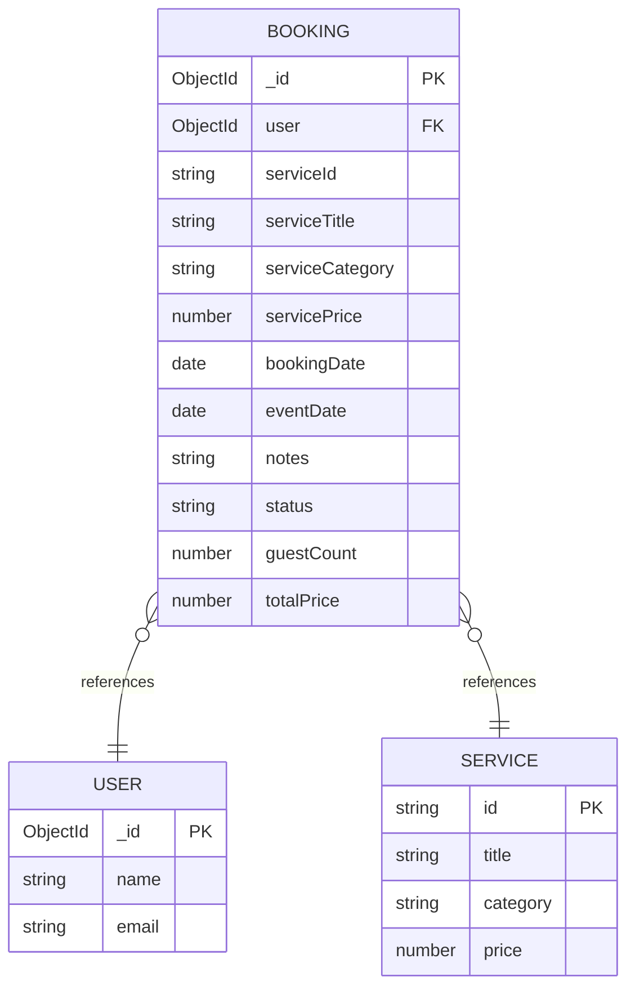

**Diagram sources**
- [bookingSchema.js:1-53](file://backend/models/bookingSchema.js#L1-L53)

**Section sources**
- [bookingSchema.js:1-53](file://backend/models/bookingSchema.js#L1-L53)

### Payment Schema Design
The payment schema encapsulates payment details, including amounts, commissions, merchant payouts, payment status, payment method, transaction identifiers, refund information, and metadata. It enforces amount validation and provides computed virtual fields for commission percentages.

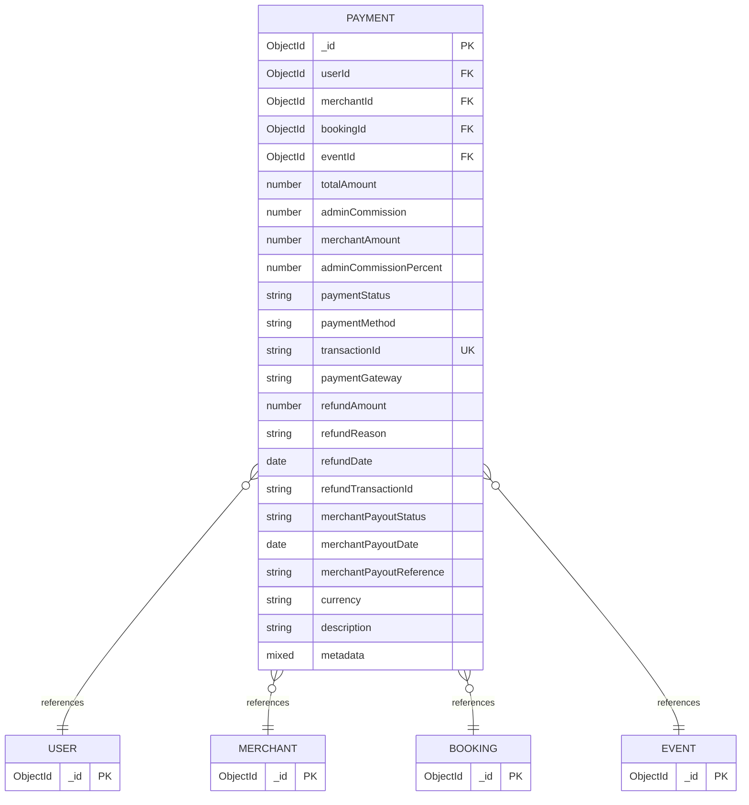

**Diagram sources**
- [paymentSchema.js:1-142](file://backend/models/paymentSchema.js#L1-L142)

**Section sources**
- [paymentSchema.js:1-142](file://backend/models/paymentSchema.js#L1-L142)

### Service-Based Booking Workflow
Service-based bookings involve collecting user preferences (service date, guest count, notes), validating uniqueness, calculating totals, and creating a booking with pending status. The workflow ensures users cannot have conflicting active bookings.

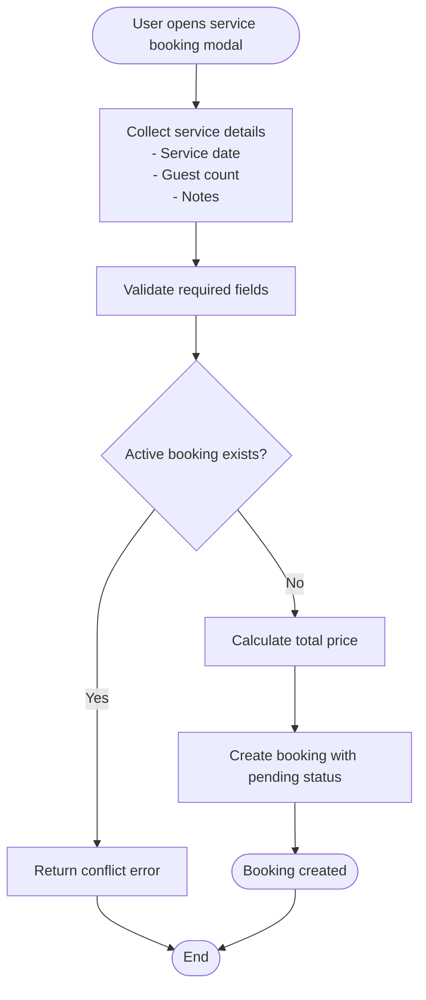

**Diagram sources**
- [BookingModal.jsx:1-317](file://frontend/src/components/BookingModal.jsx#L1-L317)
- [bookingController.js:1-233](file://backend/controller/bookingController.js#L1-L233)
- [bookingSchema.js:1-53](file://backend/models/bookingSchema.js#L1-L53)

**Section sources**
- [BookingModal.jsx:1-317](file://frontend/src/components/BookingModal.jsx#L1-L317)
- [bookingController.js:1-233](file://backend/controller/bookingController.js#L1-L233)
- [bookingSchema.js:1-53](file://backend/models/bookingSchema.js#L1-L53)

### Ticketed Event Booking Workflow
Ticketed event booking involves selecting ticket type, quantity, applying coupons, and confirming payment. The system validates ticket availability, updates sold counts, and creates confirmed bookings with pending payment status.

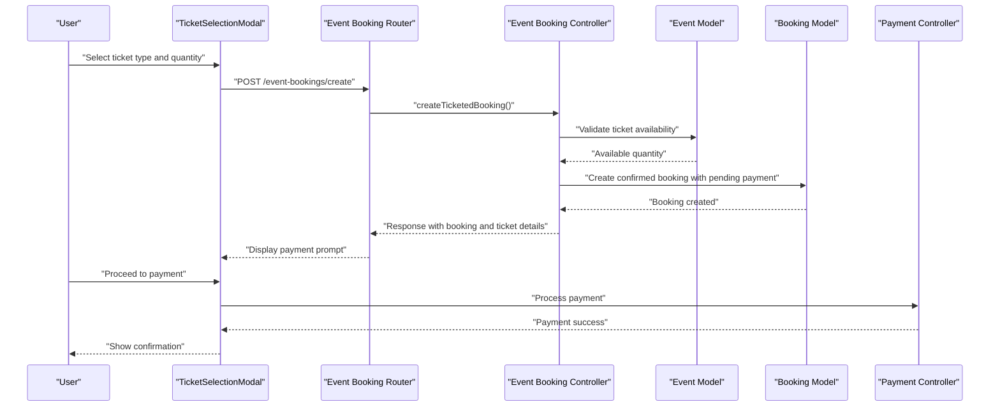

**Diagram sources**
- [TicketSelectionModal.jsx:1-448](file://frontend/src/components/TicketSelectionModal.jsx#L1-L448)
- [eventBookingRouter.js:1-47](file://backend/router/eventBookingRouter.js#L1-L47)
- [eventBookingController.js:321-589](file://backend/controller/eventBookingController.js#L321-L589)
- [bookingSchema.js:1-53](file://backend/models/bookingSchema.js#L1-L53)
- [paymentController.js:1-577](file://backend/controller/paymentController.js#L1-L577)

**Section sources**
- [TicketSelectionModal.jsx:1-448](file://frontend/src/components/TicketSelectionModal.jsx#L1-L448)
- [eventBookingRouter.js:1-47](file://backend/router/eventBookingRouter.js#L1-L47)
- [eventBookingController.js:321-589](file://backend/controller/eventBookingController.js#L321-L589)
- [paymentController.js:1-577](file://backend/controller/paymentController.js#L1-L577)

### Payment Processing Integration
Payment processing integrates with manual payment workflows and supports multiple payment methods. The system generates transaction IDs, distributes payments between admin and merchant, and updates booking and payment records.

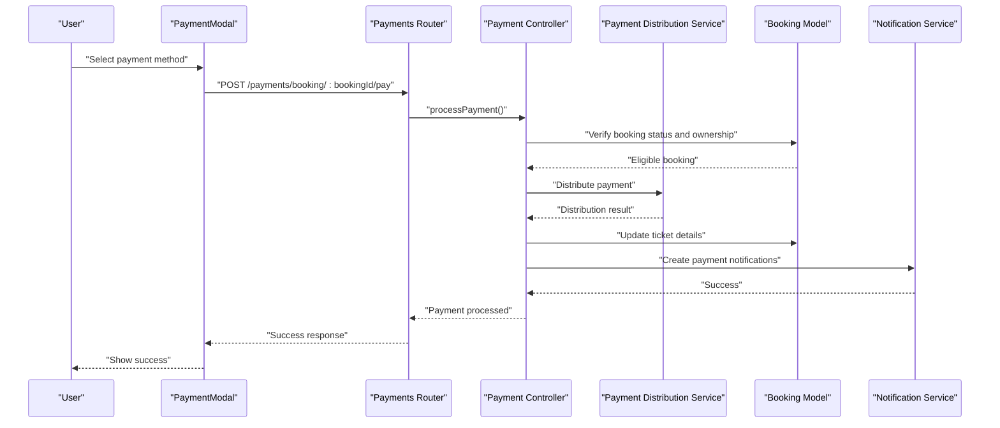

**Diagram sources**
- [PaymentModal.jsx:1-206](file://frontend/src/components/PaymentModal.jsx#L1-L206)
- [paymentsRouter.js:1-44](file://backend/router/paymentsRouter.js#L1-L44)
- [paymentController.js:10-141](file://backend/controller/paymentController.js#L10-L141)
- [bookingSchema.js:1-53](file://backend/models/bookingSchema.js#L1-L53)

**Section sources**
- [PaymentModal.jsx:1-206](file://frontend/src/components/PaymentModal.jsx#L1-L206)
- [paymentsRouter.js:1-44](file://backend/router/paymentsRouter.js#L1-L44)
- [paymentController.js:10-141](file://backend/controller/paymentController.js#L10-L141)

### Refund and Cancellation Handling
The system supports refund processing for paid bookings and cancellation for pending bookings. Refund processing triggers distribution adjustments and notifications to users and merchants.

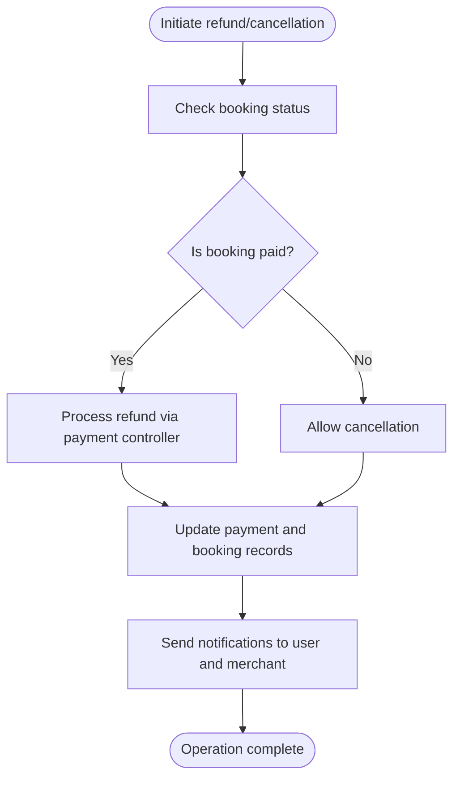

**Diagram sources**
- [paymentController.js:221-315](file://backend/controller/paymentController.js#L221-L315)
- [bookingController.js:124-171](file://backend/controller/bookingController.js#L124-L171)
- [paymentSchema.js:1-142](file://backend/models/paymentSchema.js#L1-L142)

**Section sources**
- [paymentController.js:221-315](file://backend/controller/paymentController.js#L221-L315)
- [bookingController.js:124-171](file://backend/controller/bookingController.js#L124-L171)

### Booking Status Management
Booking status transitions are managed through dedicated endpoints for user, merchant, and admin roles. The system enforces valid status transitions and prevents invalid operations on completed or already cancelled bookings.

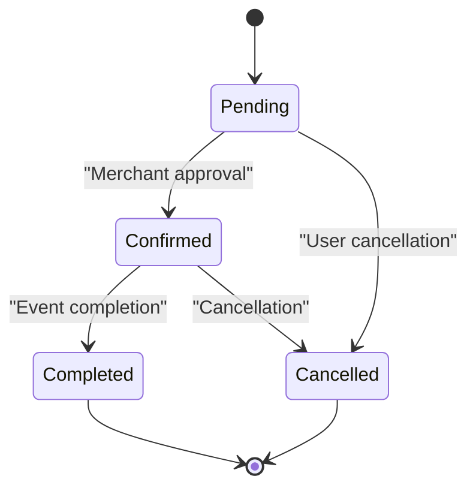

**Diagram sources**
- [bookingController.js:193-232](file://backend/controller/bookingController.js#L193-L232)
- [eventBookingController.js:635-761](file://backend/controller/eventBookingController.js#L635-L761)

**Section sources**
- [bookingController.js:193-232](file://backend/controller/bookingController.js#L193-L232)
- [eventBookingController.js:635-761](file://backend/controller/eventBookingController.js#L635-L761)

### Frontend Booking and Payment Components
The frontend provides intuitive modals for booking and payment:
- Service Booking Modal: Collects service details, guest count, notes, and coupon application for full-service events.
- Ticket Selection Modal: Handles ticket type selection, quantity validation, coupon application, and booking submission for ticketed events.
- Payment Modal: Presents payment method selection, order summary, and secure payment processing for ticketed events.
- Service Payment Modal: Manages payment processing for service bookings after merchant approval.

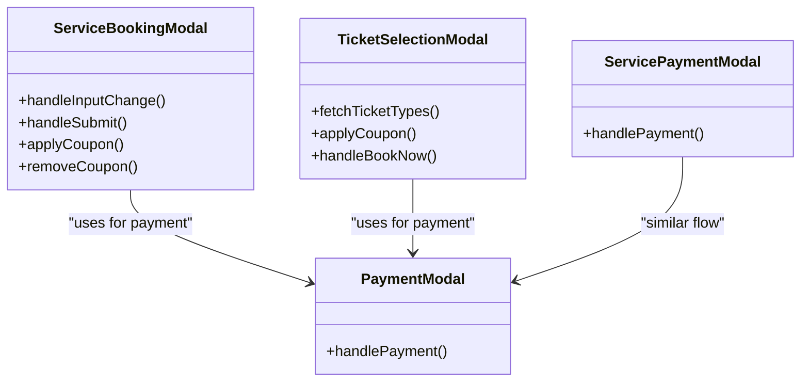

**Diagram sources**
- [ServiceBookingModal.jsx:1-440](file://frontend/src/components/ServiceBookingModal.jsx#L1-L440)
- [TicketSelectionModal.jsx:1-448](file://frontend/src/components/TicketSelectionModal.jsx#L1-L448)
- [PaymentModal.jsx:1-206](file://frontend/src/components/PaymentModal.jsx#L1-L206)
- [ServicePaymentModal.jsx:1-246](file://frontend/src/components/ServicePaymentModal.jsx#L1-L246)

**Section sources**
- [ServiceBookingModal.jsx:1-440](file://frontend/src/components/ServiceBookingModal.jsx#L1-L440)
- [TicketSelectionModal.jsx:1-448](file://frontend/src/components/TicketSelectionModal.jsx#L1-L448)
- [PaymentModal.jsx:1-206](file://frontend/src/components/PaymentModal.jsx#L1-L206)
- [ServicePaymentModal.jsx:1-246](file://frontend/src/components/ServicePaymentModal.jsx#L1-L246)

## Dependency Analysis
The system exhibits clear separation of concerns with well-defined dependencies:
- Controllers depend on models for data persistence and business rule enforcement.
- Routers delegate requests to appropriate controllers based on resource types.
- Frontend modals depend on backend endpoints for data synchronization.
- Payment processing depends on distribution services and notification systems.

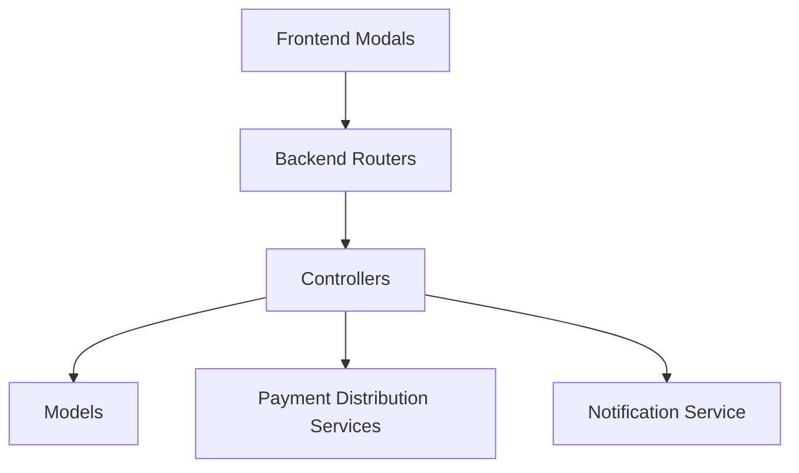

**Diagram sources**
- [bookingRouter.js:1-26](file://backend/router/bookingRouter.js#L1-L26)
- [eventBookingRouter.js:1-47](file://backend/router/eventBookingRouter.js#L1-L47)
- [paymentsRouter.js:1-44](file://backend/router/paymentsRouter.js#L1-L44)
- [bookingController.js:1-233](file://backend/controller/bookingController.js#L1-L233)
- [eventBookingController.js:1-800](file://backend/controller/eventBookingController.js#L1-L800)
- [paymentController.js:1-577](file://backend/controller/paymentController.js#L1-L577)

**Section sources**
- [bookingRouter.js:1-26](file://backend/router/bookingRouter.js#L1-L26)
- [eventBookingRouter.js:1-47](file://backend/router/eventBookingRouter.js#L1-L47)
- [paymentsRouter.js:1-44](file://backend/router/paymentsRouter.js#L1-L44)
- [bookingController.js:1-233](file://backend/controller/bookingController.js#L1-L233)
- [eventBookingController.js:1-800](file://backend/controller/eventBookingController.js#L1-L800)
- [paymentController.js:1-577](file://backend/controller/paymentController.js#L1-L577)

## Performance Considerations
- Database indexing: Payment schema includes indexes on user, merchant, booking, and transaction identifiers to optimize query performance.
- Amount validation: Pre-save middleware ensures payment amount accuracy, preventing discrepancies and reducing reconciliation overhead.
- Asynchronous operations: Payment processing and notifications are handled asynchronously to maintain responsive user experience.
- Capacity management: Ticketed event booking validates availability before creating bookings, preventing overselling scenarios.

## Troubleshooting Guide
Common issues and resolutions:
- Booking conflicts: Users receive errors when attempting to create overlapping bookings. Ensure unique service/event combinations per user.
- Payment failures: Validate payment method selection and amount eligibility. Check transaction logs for failed attempts.
- Coupon validation: Verify coupon codes, expiration dates, and usage limits before applying discounts.
- Capacity errors: Ticketed events display available quantities; ensure requested quantities do not exceed remaining inventory.
- Refund processing: Confirm booking payment status and authorization before initiating refunds.

**Section sources**
- [bookingController.js:124-171](file://backend/controller/bookingController.js#L124-L171)
- [eventBookingController.js:321-589](file://backend/controller/eventBookingController.js#L321-L589)
- [paymentController.js:221-315](file://backend/controller/paymentController.js#L221-L315)

## Conclusion
The Event Management Platform's booking and payment system provides a robust foundation for managing service and ticketed event bookings. The modular architecture, clear schema designs, and comprehensive frontend modals enable seamless user experiences while maintaining strict business rule enforcement. The system supports flexible payment methods, automated notifications, and efficient capacity management, ensuring reliable operations across diverse event types.