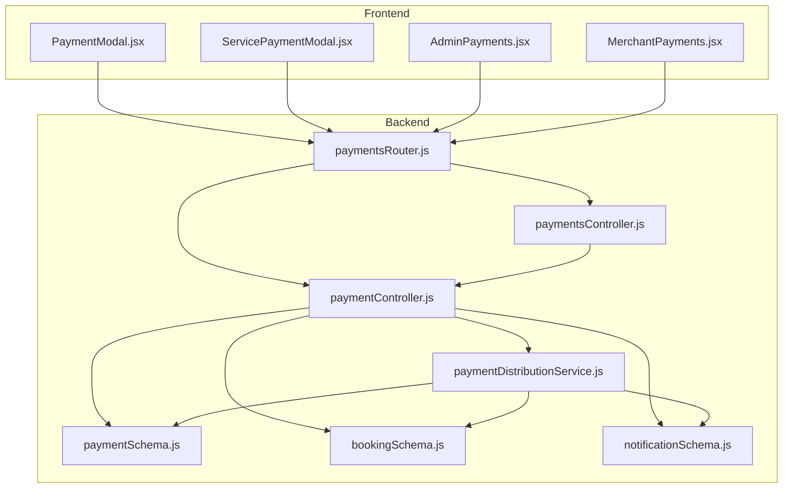
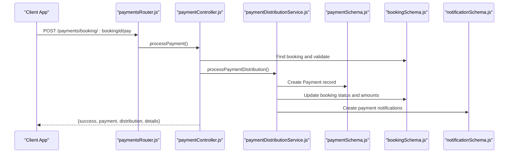
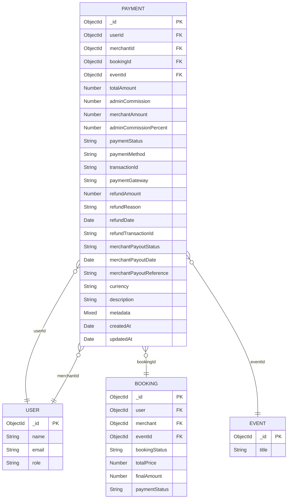
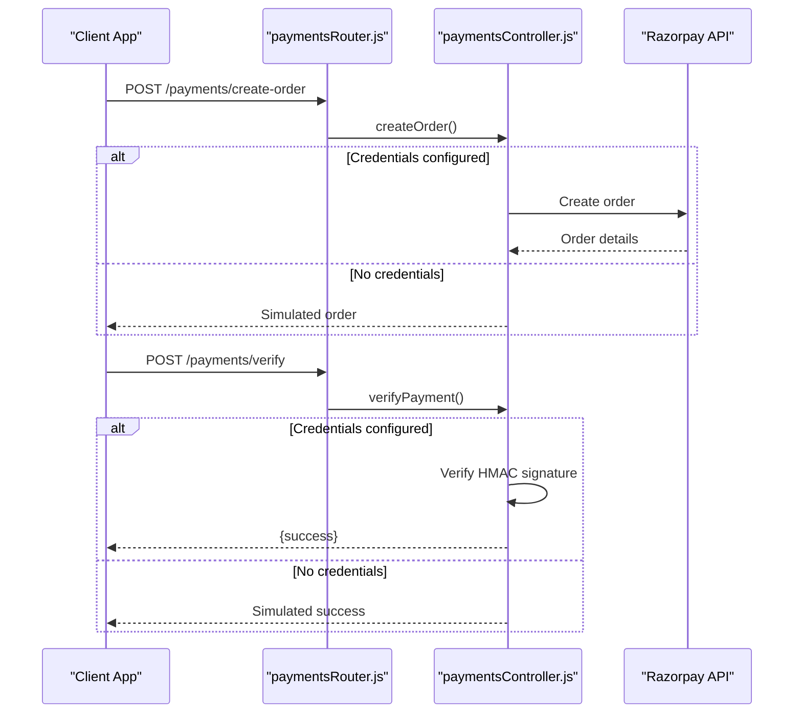
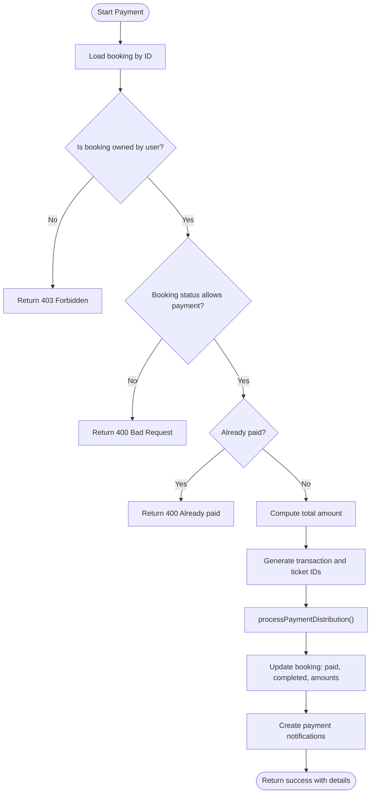
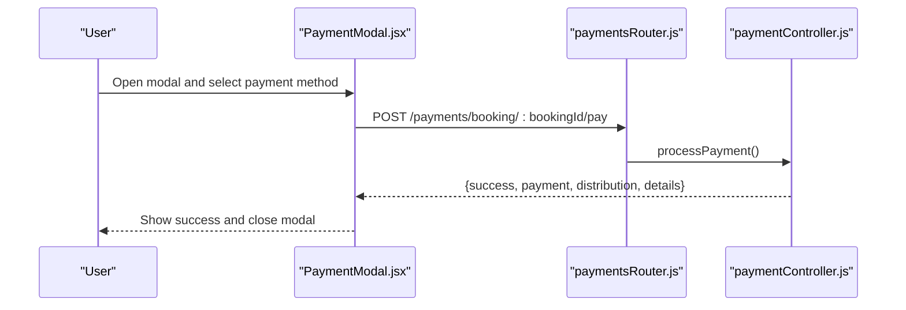
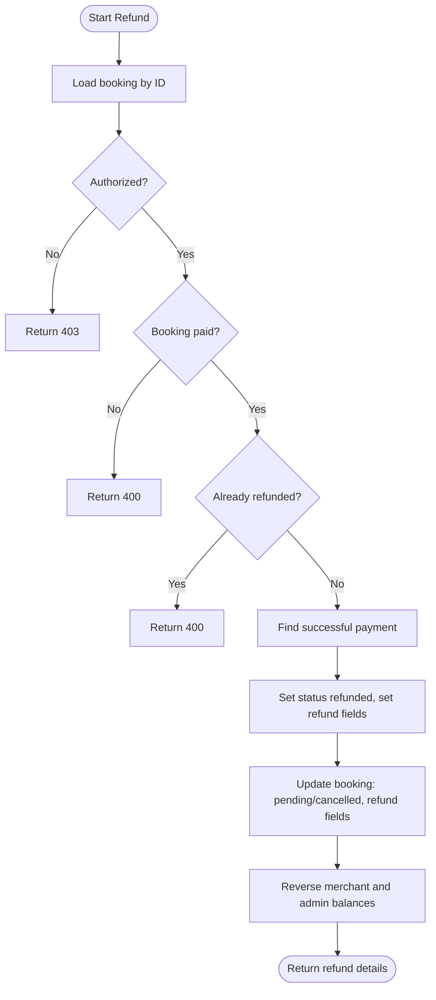
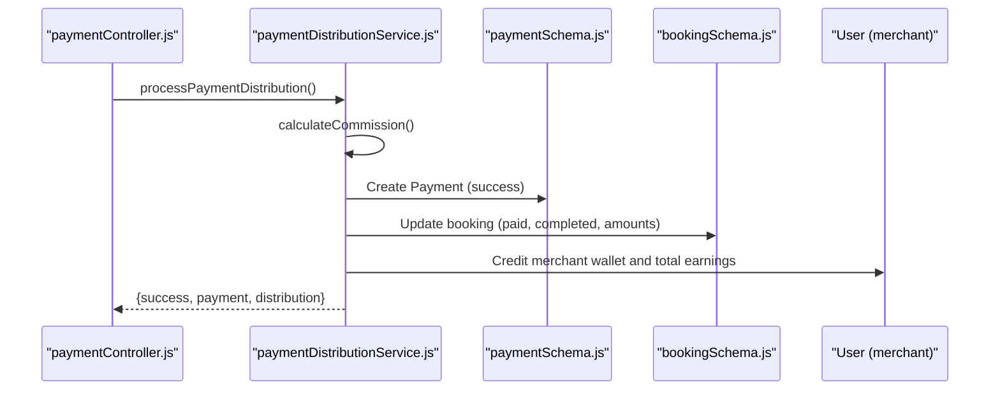
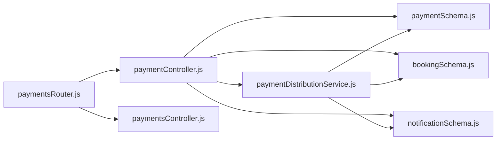

# Payment Processing System

<cite>
**Referenced Files in This Document**
- [paymentSchema.js](file://backend/models/paymentSchema.js)
- [paymentController.js](file://backend/controller/paymentController.js)
- [paymentsController.js](file://backend/controller/paymentsController.js)
- [paymentsRouter.js](file://backend/router/paymentsRouter.js)
- [paymentDistributionService.js](file://backend/services/paymentDistributionService.js)
- [bookingSchema.js](file://backend/models/bookingSchema.js)
- [notificationSchema.js](file://backend/models/notificationSchema.js)
- [PaymentModal.jsx](file://frontend/src/components/PaymentModal.jsx)
- [ServicePaymentModal.jsx](file://frontend/src/components/ServicePaymentModal.jsx)
- [AdminPayments.jsx](file://frontend/src/pages/dashboards/AdminPayments.jsx)
- [MerchantPayments.jsx](file://frontend/src/pages/dashboards/MerchantPayments.jsx)
</cite>

## Table of Contents
1. [Introduction](#introduction)
2. [Project Structure](#project-structure)
3. [Core Components](#core-components)
4. [Architecture Overview](#architecture-overview)
5. [Detailed Component Analysis](#detailed-component-analysis)
6. [Dependency Analysis](#dependency-analysis)
7. [Performance Considerations](#performance-considerations)
8. [Troubleshooting Guide](#troubleshooting-guide)
9. [Conclusion](#conclusion)

## Introduction
This document provides comprehensive documentation for the payment processing system component. It explains payment gateway integration, transaction handling, and payment confirmation workflows. It documents the payment schema design, payment modal implementation, secure payment processing, validation logic, API endpoints, verification mechanisms, error handling strategies, payment distribution to merchants, refund processing, security measures, status tracking, notification integration, and payment analytics.

## Project Structure
The payment system spans backend models/controllers/services, frontend modals, and admin/merchant dashboards. Key areas:
- Backend models define payment, booking, and notification schemas.
- Controllers implement payment workflows and administrative analytics.
- Services encapsulate distribution and refund logic.
- Frontend modals provide secure payment UI for ticketed and service bookings.
- Admin and merchant dashboards present payment analytics and earnings.

**Diagram sources**
- [paymentsRouter.js:1-44](file://backend/router/paymentsRouter.js#L1-L44)
- [paymentController.js:1-577](file://backend/controller/paymentController.js#L1-L577)
- [paymentsController.js:1-281](file://backend/controller/paymentsController.js#L1-L281)
- [paymentDistributionService.js:1-340](file://backend/services/paymentDistributionService.js#L1-L340)
- [paymentSchema.js:1-142](file://backend/models/paymentSchema.js#L1-L142)
- [bookingSchema.js:1-53](file://backend/models/bookingSchema.js#L1-L53)
- [notificationSchema.js:1-36](file://backend/models/notificationSchema.js#L1-L36)
- [PaymentModal.jsx:1-206](file://frontend/src/components/PaymentModal.jsx#L1-L206)
- [ServicePaymentModal.jsx:1-246](file://frontend/src/components/ServicePaymentModal.jsx#L1-L246)
- [AdminPayments.jsx:1-131](file://frontend/src/pages/dashboards/AdminPayments.jsx#L1-L131)
- [MerchantPayments.jsx:1-123](file://frontend/src/pages/dashboards/MerchantPayments.jsx#L1-L123)

**Section sources**
- [paymentsRouter.js:1-44](file://backend/router/paymentsRouter.js#L1-L44)
- [paymentController.js:1-577](file://backend/controller/paymentController.js#L1-L577)
- [paymentsController.js:1-281](file://backend/controller/paymentsController.js#L1-L281)
- [paymentDistributionService.js:1-340](file://backend/services/paymentDistributionService.js#L1-L340)
- [paymentSchema.js:1-142](file://backend/models/paymentSchema.js#L1-L142)
- [bookingSchema.js:1-53](file://backend/models/bookingSchema.js#L1-L53)
- [notificationSchema.js:1-36](file://backend/models/notificationSchema.js#L1-L36)
- [PaymentModal.jsx:1-206](file://frontend/src/components/PaymentModal.jsx#L1-L206)
- [ServicePaymentModal.jsx:1-246](file://frontend/src/components/ServicePaymentModal.jsx#L1-L246)
- [AdminPayments.jsx:1-131](file://frontend/src/pages/dashboards/AdminPayments.jsx#L1-L131)
- [MerchantPayments.jsx:1-123](file://frontend/src/pages/dashboards/MerchantPayments.jsx#L1-L123)

## Core Components
- Payment Schema: Defines transaction fields, payment status, methods, refund details, payout tracking, and amount validation.
- Payment Controllers: Implement manual payment processing, booking payment workflows, refunds, statistics, and merchant earnings.
- Payment Services: Encapsulate commission distribution, refund reversal, and analytics aggregation.
- Payment Modals: Secure UI for ticketed and service payments with method selection and state transitions.
- Admin/Merchant Dashboards: Present payment analytics, statistics, and earnings summaries.

**Section sources**
- [paymentSchema.js:1-142](file://backend/models/paymentSchema.js#L1-L142)
- [paymentController.js:1-577](file://backend/controller/paymentController.js#L1-L577)
- [paymentsController.js:1-281](file://backend/controller/paymentsController.js#L1-L281)
- [paymentDistributionService.js:1-340](file://backend/services/paymentDistributionService.js#L1-L340)
- [PaymentModal.jsx:1-206](file://frontend/src/components/PaymentModal.jsx#L1-L206)
- [ServicePaymentModal.jsx:1-246](file://frontend/src/components/ServicePaymentModal.jsx#L1-L246)
- [AdminPayments.jsx:1-131](file://frontend/src/pages/dashboards/AdminPayments.jsx#L1-L131)
- [MerchantPayments.jsx:1-123](file://frontend/src/pages/dashboards/MerchantPayments.jsx#L1-L123)

## Architecture Overview
The system supports two primary payment flows:
- Manual payment flow via booking payment controller and distribution service.
- Razorpay integration via separate controller with order creation and signature verification.

**Diagram sources**
- [paymentsRouter.js:28-28](file://backend/router/paymentsRouter.js#L28-L28)
- [paymentController.js:11-141](file://backend/controller/paymentController.js#L11-L141)
- [paymentDistributionService.js:33-159](file://backend/services/paymentDistributionService.js#L33-L159)
- [paymentSchema.js:1-142](file://backend/models/paymentSchema.js#L1-L142)
- [bookingSchema.js:1-53](file://backend/models/bookingSchema.js#L1-L53)
- [notificationSchema.js:1-36](file://backend/models/notificationSchema.js#L1-L36)

## Detailed Component Analysis

### Payment Schema Design
The payment schema defines transaction details, status tracking, methods, refunds, payouts, and metadata. It includes:
- Identity: userId, merchantId, bookingId, eventId
- Amounts: totalAmount, adminCommission, merchantAmount, adminCommissionPercent
- Status: paymentStatus, refund fields, merchantPayout fields
- Details: paymentMethod, transactionId, paymentGateway, currency, description, metadata
- Validation: pre-save middleware enforces amount consistency
- Indexes: optimized queries on user, merchant, booking, transactionId, status

**Diagram sources**
- [paymentSchema.js:3-109](file://backend/models/paymentSchema.js#L3-L109)
- [bookingSchema.js:3-49](file://backend/models/bookingSchema.js#L3-L49)

**Section sources**
- [paymentSchema.js:1-142](file://backend/models/paymentSchema.js#L1-L142)

### Payment Gateway Integration
The system integrates with Razorpay optionally:
- Order creation endpoint accepts amount, currency, receipt and proxies to Razorpay API when credentials are configured; otherwise returns a simulated order.
- Signature verification endpoint validates the payment signature using HMAC-SHA256 without external dependencies.
- Service and ticket payment endpoints support manual cash/card/netbanking/wallet methods.

**Diagram sources**
- [paymentsController.js:8-106](file://backend/controller/paymentsController.js#L8-L106)
- [paymentsRouter.js:18-19](file://backend/router/paymentsRouter.js#L18-L19)

**Section sources**
- [paymentsController.js:1-281](file://backend/controller/paymentsController.js#L1-L281)
- [paymentsRouter.js:1-44](file://backend/router/paymentsRouter.js#L1-L44)

### Transaction Handling and Payment Confirmation Workflows
Manual payment workflow:
- Validates booking ownership and status, computes total amount, generates transaction and ticket IDs, processes distribution, updates booking, and creates notifications.

**Diagram sources**
- [paymentController.js:11-141](file://backend/controller/paymentController.js#L11-L141)
- [paymentDistributionService.js:33-159](file://backend/services/paymentDistributionService.js#L33-L159)

**Section sources**
- [paymentController.js:1-577](file://backend/controller/paymentController.js#L1-L577)
- [paymentDistributionService.js:1-340](file://backend/services/paymentDistributionService.js#L1-L340)

### Payment Modal Implementation and Secure Processing
Frontend modals provide secure payment experiences:
- PaymentModal.jsx: Selects payment method, displays order summary, simulates processing, and triggers ticketed booking payment API.
- ServicePaymentModal.jsx: Selects payment method, displays service summary, simulates processing, and calls service payment API.

Both modals:
- Use authentication headers.
- Show loading states and success messages.
- Integrate with backend APIs for payment completion.

**Diagram sources**
- [PaymentModal.jsx:21-62](file://frontend/src/components/PaymentModal.jsx#L21-L62)
- [paymentsRouter.js:28-28](file://backend/router/paymentsRouter.js#L28-L28)
- [paymentController.js:11-141](file://backend/controller/paymentController.js#L11-L141)

**Section sources**
- [PaymentModal.jsx:1-206](file://frontend/src/components/PaymentModal.jsx#L1-L206)
- [ServicePaymentModal.jsx:1-246](file://frontend/src/components/ServicePaymentModal.jsx#L1-L246)

### Payment Validation
Backend validation ensures:
- Booking ownership and status checks.
- Payment amount verification against expected totals.
- Duplicate payment prevention via payment distribution service.
- Amount consistency enforced by pre-save middleware on Payment model.

**Section sources**
- [paymentController.js:23-64](file://backend/controller/paymentController.js#L23-L64)
- [paymentDistributionService.js:58-66](file://backend/services/paymentDistributionService.js#L58-L66)
- [paymentSchema.js:129-140](file://backend/models/paymentSchema.js#L129-L140)

### Refund Processing
Refund workflow:
- Validates authorization (booking owner or admin).
- Ensures booking is paid and not already refunded.
- Reverses payment status, calculates refund amount, updates booking, and reverses merchant/admin balances.

**Diagram sources**
- [paymentController.js:222-315](file://backend/controller/paymentController.js#L222-L315)
- [paymentDistributionService.js:167-251](file://backend/services/paymentDistributionService.js#L167-L251)

**Section sources**
- [paymentController.js:221-315](file://backend/controller/paymentController.js#L221-L315)
- [paymentDistributionService.js:161-251](file://backend/services/paymentDistributionService.js#L161-L251)

### Payment Distribution to Merchants
Distribution logic:
- Calculates admin commission and merchant amount.
- Prevents duplicate payments.
- Creates payment record, updates booking, credits merchant wallet, and updates admin commission tracking.

**Diagram sources**
- [paymentController.js:70-81](file://backend/controller/paymentController.js#L70-L81)
- [paymentDistributionService.js:33-159](file://backend/services/paymentDistributionService.js#L33-L159)

**Section sources**
- [paymentDistributionService.js:1-340](file://backend/services/paymentDistributionService.js#L1-L340)

### Payment Security Measures
- Optional Razorpay integration with signature verification using HMAC-SHA256.
- Simulated flows when credentials are missing to maintain development UX.
- Secure modal UI with SSL messaging and loading states.
- Authentication middleware on protected endpoints.

**Section sources**
- [paymentsController.js:5-106](file://backend/controller/paymentsController.js#L5-L106)
- [PaymentModal.jsx:161-163](file://frontend/src/components/PaymentModal.jsx#L161-L163)
- [paymentsRouter.js:12-13](file://backend/router/paymentsRouter.js#L12-L13)

### Payment Status Tracking and Notification Integration
- Payment status tracked in Payment model (pending, success, failed, refunded).
- Merchant payout status tracked separately.
- Notifications created for user and merchant upon payment and refund actions.

**Section sources**
- [paymentSchema.js:48-89](file://backend/models/paymentSchema.js#L48-L89)
- [paymentController.js:89-113](file://backend/controller/paymentController.js#L89-L113)
- [paymentController.js:269-293](file://backend/controller/paymentController.js#L269-L293)
- [notificationSchema.js:1-36](file://backend/models/notificationSchema.js#L1-L36)

### Payment Analytics and Reporting
- Admin dashboard aggregates total revenue, commission, merchant payouts, transactions, and monthly stats.
- Merchant earnings dashboard shows wallet balance, lifetime earnings, total earnings, transactions, and recent transactions.

**Section sources**
- [paymentController.js:317-399](file://backend/controller/paymentController.js#L317-L399)
- [paymentController.js:401-517](file://backend/controller/paymentController.js#L401-L517)
- [AdminPayments.jsx:14-25](file://frontend/src/pages/dashboards/AdminPayments.jsx#L14-L25)
- [MerchantPayments.jsx:15-29](file://frontend/src/pages/dashboards/MerchantPayments.jsx#L15-L29)

## Dependency Analysis
The payment system exhibits clear separation of concerns:
- Router delegates to controllers.
- Controllers orchestrate services and models.
- Services encapsulate business logic for distribution and refunds.
- Frontend modals integrate with backend endpoints.

**Diagram sources**
- [paymentsRouter.js:1-44](file://backend/router/paymentsRouter.js#L1-L44)
- [paymentController.js:1-577](file://backend/controller/paymentController.js#L1-L577)
- [paymentsController.js:1-281](file://backend/controller/paymentsController.js#L1-L281)
- [paymentDistributionService.js:1-340](file://backend/services/paymentDistributionService.js#L1-L340)
- [paymentSchema.js:1-142](file://backend/models/paymentSchema.js#L1-L142)
- [bookingSchema.js:1-53](file://backend/models/bookingSchema.js#L1-L53)
- [notificationSchema.js:1-36](file://backend/models/notificationSchema.js#L1-L36)

**Section sources**
- [paymentsRouter.js:1-44](file://backend/router/paymentsRouter.js#L1-L44)
- [paymentController.js:1-577](file://backend/controller/paymentController.js#L1-L577)
- [paymentDistributionService.js:1-340](file://backend/services/paymentDistributionService.js#L1-L340)

## Performance Considerations
- Indexes on Payment model (user, merchant, booking, transactionId, status) improve query performance.
- Aggregation queries for statistics leverage facets for efficient grouping and sorting.
- Pre-save middleware prevents invalid states but adds validation overhead; ensure client-side validation reduces unnecessary requests.
- Notification creation occurs asynchronously; consider queueing for high-volume scenarios.

[No sources needed since this section provides general guidance]

## Troubleshooting Guide
Common issues and resolutions:
- Payment amount mismatch: Ensure finalAmount or totalPrice matches paymentAmount.
- Duplicate payment attempts: Distribution service prevents duplicate payments for the same booking.
- Unauthorized access: Controllers enforce ownership and admin roles.
- Razorpay signature failure: Verify credentials and signature generation logic.
- Refund errors: Ensure booking is paid and not already refunded.

**Section sources**
- [paymentController.js:56-64](file://backend/controller/paymentController.js#L56-L64)
- [paymentDistributionService.js:58-66](file://backend/services/paymentDistributionService.js#L58-L66)
- [paymentController.js:239-245](file://backend/controller/paymentController.js#L239-L245)
- [paymentsController.js:93-105](file://backend/controller/paymentsController.js#L93-L105)
- [paymentController.js:255-261](file://backend/controller/paymentController.js#L255-L261)

## Conclusion
The payment processing system provides robust, secure, and extensible payment workflows. It supports manual and optional Razorpay integrations, comprehensive validation, automated distribution to merchants, refund handling, rich analytics, and notification integration. The modular design enables future enhancements such as additional payment gateways, advanced analytics, and improved security measures.