# Database Design

<cite>
**Referenced Files in This Document**
- [dbConnection.js](file://backend/database/dbConnection.js)
- [userSchema.js](file://backend/models/userSchema.js)
- [eventSchema.js](file://backend/models/eventSchema.js)
- [bookingSchema.js](file://backend/models/bookingSchema.js)
- [serviceSchema.js](file://backend/models/serviceSchema.js)
- [couponSchema.js](file://backend/models/couponSchema.js)
- [followSchema.js](file://backend/models/followSchema.js)
- [reviewSchema.js](file://backend/models/reviewSchema.js)
- [ratingSchema.js](file://backend/models/ratingSchema.js)
- [notificationSchema.js](file://backend/models/notificationSchema.js)
- [paymentSchema.js](file://backend/models/paymentSchema.js)
- [registrationSchema.js](file://backend/models/registrationSchema.js)
- [messageSchema.js](file://backend/models/messageSchema.js)
- [MONGODB_ATLAS_SETUP_GUIDE.md](file://backend/MONGODB_ATLAS_SETUP_GUIDE.md)
- [MONGODB_ATLAS_PERMANENT_SOLUTION.md](file://backend/MONGODB_ATLAS_PERMANENT_SOLUTION.md)
- [DATABASE_TROUBLESHOOTING.md](file://backend/DATABASE_TROUBLESHOOTING.md)
- [DATABASE_SETUP.md](file://backend/DATABASE_SETUP.md)
</cite>

## Table of Contents
1. [Introduction](#introduction)
2. [Project Structure](#project-structure)
3. [Core Components](#core-components)
4. [Architecture Overview](#architecture-overview)
5. [Detailed Component Analysis](#detailed-component-analysis)
6. [Dependency Analysis](#dependency-analysis)
7. [Performance Considerations](#performance-considerations)
8. [Troubleshooting Guide](#troubleshooting-guide)
9. [Conclusion](#conclusion)
10. [Appendices](#appendices)

## Introduction
This document provides comprehensive database design documentation for the MERN Stack Event Management Platform. It focuses on MongoDB schema design, entity relationships, and data modeling decisions across the collections used by the backend. It also covers indexing strategies, query optimization, database connection management, MongoDB Atlas configuration, and migration procedures. The goal is to enable developers and stakeholders to understand how data is structured, how entities relate, and how to maintain and scale the database effectively.

## Project Structure
The database layer is organized around Mongoose models under the models directory and a centralized connection module under database. The connection module configures robust connectivity to MongoDB Atlas with multiple fallback strategies and DNS overrides to improve reliability. Supporting documentation files guide Atlas setup, permanent solutions, and troubleshooting.

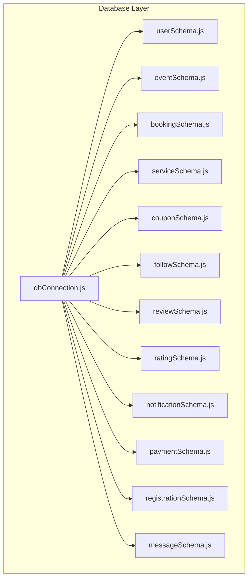

**Diagram sources**
- [dbConnection.js:19-94](file://backend/database/dbConnection.js#L19-L94)
- [userSchema.js:4-52](file://backend/models/userSchema.js#L4-L52)
- [eventSchema.js:3-20](file://backend/models/eventSchema.js#L3-L20)
- [bookingSchema.js:3-50](file://backend/models/bookingSchema.js#L3-L50)
- [serviceSchema.js:14-77](file://backend/models/serviceSchema.js#L14-L77)
- [couponSchema.js:3-98](file://backend/models/couponSchema.js#L3-L98)
- [followSchema.js:3-21](file://backend/models/followSchema.js#L3-L21)
- [reviewSchema.js:3-11](file://backend/models/reviewSchema.js#L3-L11)
- [ratingSchema.js:3-23](file://backend/models/ratingSchema.js#L3-L23)
- [notificationSchema.js:3-33](file://backend/models/notificationSchema.js#L3-L33)
- [paymentSchema.js:3-109](file://backend/models/paymentSchema.js#L3-L109)
- [registrationSchema.js:3-9](file://backend/models/registrationSchema.js#L3-L9)
- [messageSchema.js:4-25](file://backend/models/messageSchema.js#L4-L25)

**Section sources**
- [dbConnection.js:19-94](file://backend/database/dbConnection.js#L19-L94)
- [userSchema.js:4-52](file://backend/models/userSchema.js#L4-L52)
- [eventSchema.js:3-20](file://backend/models/eventSchema.js#L3-L20)
- [bookingSchema.js:3-50](file://backend/models/bookingSchema.js#L3-L50)
- [serviceSchema.js:14-77](file://backend/models/serviceSchema.js#L14-L77)
- [couponSchema.js:3-98](file://backend/models/couponSchema.js#L3-L98)
- [followSchema.js:3-21](file://backend/models/followSchema.js#L3-L21)
- [reviewSchema.js:3-11](file://backend/models/reviewSchema.js#L3-L11)
- [ratingSchema.js:3-23](file://backend/models/ratingSchema.js#L3-L23)
- [notificationSchema.js:3-33](file://backend/models/notificationSchema.js#L3-L33)
- [paymentSchema.js:3-109](file://backend/models/paymentSchema.js#L3-L109)
- [registrationSchema.js:3-9](file://backend/models/registrationSchema.js#L3-L9)
- [messageSchema.js:4-25](file://backend/models/messageSchema.js#L4-L25)

## Core Components
This section documents each collection’s schema, fields, data types, validation rules, and relationships. It also highlights indexes and middleware that optimize queries and enforce data integrity.

- Users
  - Purpose: Store platform users, merchants, and admins with roles and statuses.
  - Key fields: name, businessName, phone, serviceType, email, password, role, status.
  - Validation: Name length, email format, password minimum length, role enum, status enum.
  - Indexes: None declared in schema; consider unique index on email for fast lookups.
  - Relationships: Referenced by Events (createdBy), Services (createdBy), Bookings, Coupons (createdBy), Reviews, Ratings, Notifications, Payments, Registrations.

- Events
  - Purpose: Represent event listings with metadata, pricing, and images.
  - Key fields: title, description, category, price, rating, images[], features[], createdBy.
  - Validation: Rating bounds, images array presence.
  - Indexes: None declared in schema; consider compound index on category + rating for analytics.
  - Relationships: Created by a User; linked to Reviews and Ratings; optionally linked to Bookings via registration.

- Bookings
  - Purpose: Track booking requests for services with status and pricing.
  - Key fields: user, serviceId, serviceTitle, serviceCategory, servicePrice, bookingDate, eventDate, notes, status, guestCount, totalPrice.
  - Validation: Status enum, guestCount default, totalPrice numeric.
  - Indexes: None declared in schema; consider indexes on user + createdAt, status, eventDate.
  - Relationships: References User and Service; links to Payments and Notifications.

- Services
  - Purpose: List service offerings with rich metadata and searchability.
  - Key fields: title, description, category, price, rating, images[], isActive, createdBy.
  - Validation: Category enum, price min, rating bounds, images count, lengths.
  - Indexes: Text index on title/description/category for full-text search.
  - Relationships: Created by a User; referenced by Bookings and Payments.

- Coupons
  - Purpose: Discount management with usage limits, validity, and applicability rules.
  - Key fields: code, discountType, discountValue, maxDiscount, minAmount, expiryDate, usageLimit, usedCount, isActive, description, createdBy, applicableEvents[], applicableCategories[], applicableUsers[], usageHistory[].
  - Validation: Uppercase code, discount value min, expiry date, usage limits, counts.
  - Indexes: Unique code, composite isActive + expiryDate, createdBy.
  - Middleware: Pre-save uppercase code.
  - Relationships: Created by a User; applicable to Events and Categories; tracks usage via Booking.

- Follows
  - Purpose: Track user-to-merchant follow relationships.
  - Key fields: user, merchant.
  - Validation: References User for both fields.
  - Indexes: Unique compound index on user + merchant.
  - Relationships: Both sides reference User.

- Reviews
  - Purpose: Capture textual feedback per event.
  - Key fields: user, event, rating, reviewText.
  - Validation: Rating bounds, uniqueness constraint on user + event.
  - Indexes: Unique compound index on user + event.
  - Relationships: Links User and Event.

- Ratings
  - Purpose: Capture numerical ratings per event.
  - Key fields: user, event, rating.
  - Validation: Rating bounds, uniqueness constraint on user + event.
  - Indexes: Unique compound index on user + event.
  - Relationships: Links User and Event.

- Notifications
  - Purpose: Store user-specific notifications with optional booking/event linkage.
  - Key fields: user, message, read, eventId, bookingId, type.
  - Validation: Enum for type, references for user and bookingId.
  - Indexes: None declared in schema; consider indexes on user + createdAt, read.
  - Relationships: Links User; optionally links Booking.

- Payments
  - Purpose: Record payment transactions, commissions, payouts, and refunds.
  - Key fields: userId, merchantId, bookingId, eventId, totalAmount, adminCommission, merchantAmount, adminCommissionPercent, paymentStatus, paymentMethod, transactionId, paymentGateway, refund fields, merchant payout fields, currency, description, metadata.
  - Validation: Amounts validated via pre-save middleware, enums for status and method, unique transactionId.
  - Indexes: Composite indexes on userId/merchantId + createdAt, bookingId, transactionId, paymentStatus.
  - Middleware: Pre-save amount validation.
  - Relationships: Links User (userId, merchantId), Booking, Event.

- Registrations
  - Purpose: Track user registrations for events.
  - Key fields: user, event.
  - Relationships: Links User and Event.

- Messages
  - Purpose: Store contact form submissions.
  - Key fields: name, email, subject, message.
  - Validation: Length and format checks.
  - Relationships: No relational references.

**Section sources**
- [userSchema.js:4-52](file://backend/models/userSchema.js#L4-L52)
- [eventSchema.js:3-20](file://backend/models/eventSchema.js#L3-L20)
- [bookingSchema.js:3-50](file://backend/models/bookingSchema.js#L3-L50)
- [serviceSchema.js:14-77](file://backend/models/serviceSchema.js#L14-L77)
- [couponSchema.js:3-98](file://backend/models/couponSchema.js#L3-L98)
- [followSchema.js:3-21](file://backend/models/followSchema.js#L3-L21)
- [reviewSchema.js:3-11](file://backend/models/reviewSchema.js#L3-L11)
- [ratingSchema.js:3-23](file://backend/models/ratingSchema.js#L3-L23)
- [notificationSchema.js:3-33](file://backend/models/notificationSchema.js#L3-L33)
- [paymentSchema.js:3-109](file://backend/models/paymentSchema.js#L3-L109)
- [registrationSchema.js:3-9](file://backend/models/registrationSchema.js#L3-L9)
- [messageSchema.js:4-25](file://backend/models/messageSchema.js#L4-L25)

## Architecture Overview
The database architecture centers on a single MongoDB Atlas cluster with a dedicated database name. The connection module implements three strategies to establish connectivity, including forced DNS resolution for SRV records and manual SRV resolution. Robust Mongoose options are applied for timeouts, pool sizing, write concerns, and retries. Collections are designed with explicit references and embedded arrays where appropriate, and indexes are strategically placed to support frequent queries.

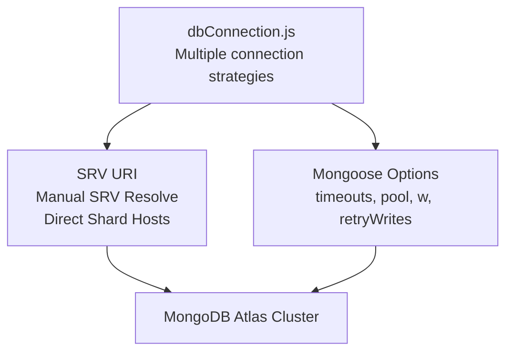

**Diagram sources**
- [dbConnection.js:19-94](file://backend/database/dbConnection.js#L19-L94)

**Section sources**
- [dbConnection.js:19-94](file://backend/database/dbConnection.js#L19-L94)

## Detailed Component Analysis

### Users
- Schema highlights: name, email (unique), password (select:false), role enum, status enum, optional business info.
- Validation: Email format, password min length, role/status enums.
- Indexes: Consider adding a unique index on email for fast lookups.
- Relationships: Creator of Events, Services; referenced by Bookings, Coupons, Reviews, Ratings, Notifications, Payments, Registrations.

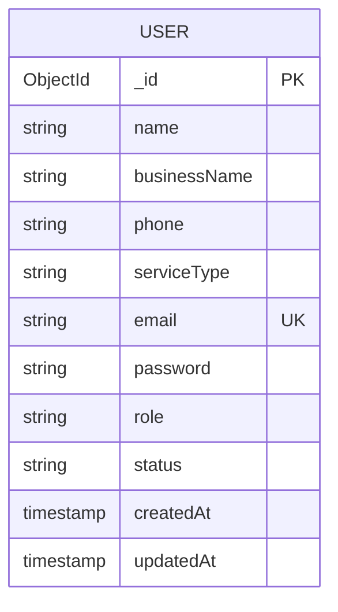

**Diagram sources**
- [userSchema.js:4-52](file://backend/models/userSchema.js#L4-L52)

**Section sources**
- [userSchema.js:4-52](file://backend/models/userSchema.js#L4-L52)

### Events
- Schema highlights: title, description, category, price, rating bounds, images array, features array, createdBy.
- Validation: Rating min/max, images presence.
- Indexes: Consider category + rating for analytics.
- Relationships: Created by User; linked to Reviews, Ratings, Registrations.

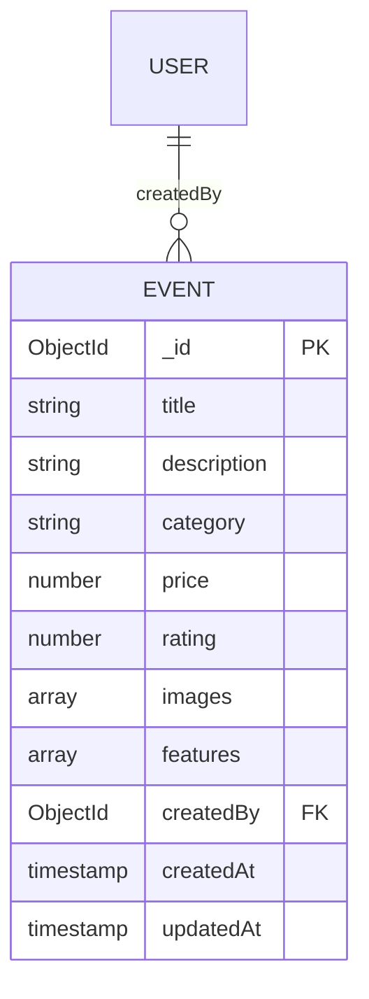

**Diagram sources**
- [eventSchema.js:3-20](file://backend/models/eventSchema.js#L3-L20)
- [userSchema.js:4-52](file://backend/models/userSchema.js#L4-L52)

**Section sources**
- [eventSchema.js:3-20](file://backend/models/eventSchema.js#L3-L20)
- [userSchema.js:4-52](file://backend/models/userSchema.js#L4-L52)

### Bookings
- Schema highlights: user, service identifiers, dates, notes, status enum, guestCount, totalPrice.
- Validation: Status enum, guestCount default, totalPrice numeric.
- Indexes: Consider user + createdAt, status, eventDate.
- Relationships: References User and Service; links to Payments and Notifications.

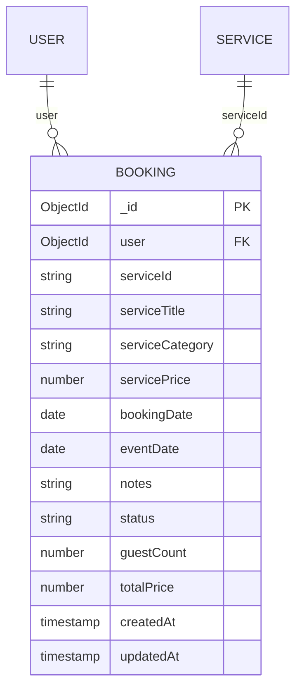

**Diagram sources**
- [bookingSchema.js:3-50](file://backend/models/bookingSchema.js#L3-L50)
- [userSchema.js:4-52](file://backend/models/userSchema.js#L4-L52)
- [serviceSchema.js:14-77](file://backend/models/serviceSchema.js#L14-L77)

**Section sources**
- [bookingSchema.js:3-50](file://backend/models/bookingSchema.js#L3-L50)
- [userSchema.js:4-52](file://backend/models/userSchema.js#L4-L52)
- [serviceSchema.js:14-77](file://backend/models/serviceSchema.js#L14-L77)

### Services
- Schema highlights: title, description, category enum, price, rating, images array, isActive, createdBy.
- Validation: Category enum, price min, rating bounds, images count, lengths.
- Indexes: Text index on title/description/category for search.
- Relationships: Created by User; referenced by Bookings and Payments.

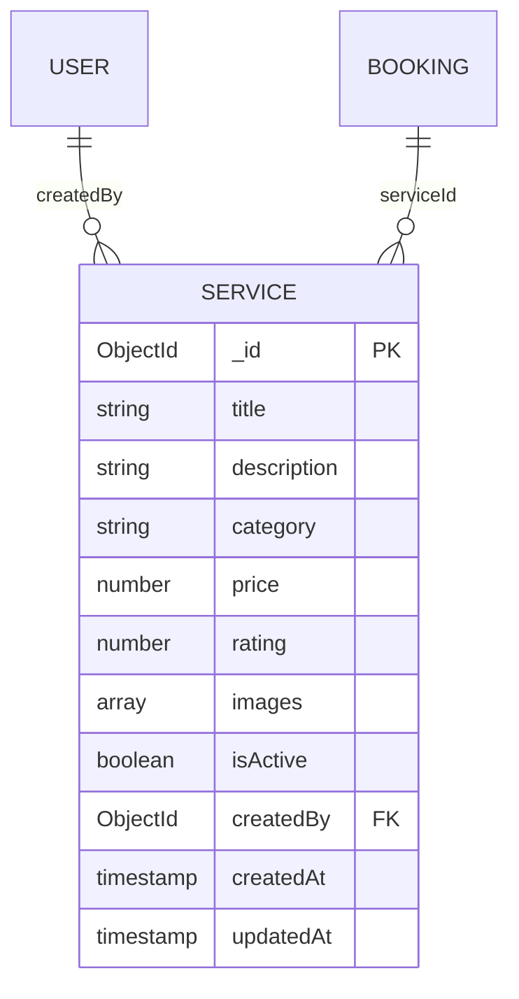

**Diagram sources**
- [serviceSchema.js:14-77](file://backend/models/serviceSchema.js#L14-L77)
- [userSchema.js:4-52](file://backend/models/userSchema.js#L4-L52)
- [bookingSchema.js:3-50](file://backend/models/bookingSchema.js#L3-L50)

**Section sources**
- [serviceSchema.js:14-77](file://backend/models/serviceSchema.js#L14-L77)
- [userSchema.js:4-52](file://backend/models/userSchema.js#L4-L52)
- [bookingSchema.js:3-50](file://backend/models/bookingSchema.js#L3-L50)

### Coupons
- Schema highlights: code (unique, uppercase), discountType, discountValue, maxDiscount, minAmount, expiryDate, usageLimit, usedCount, isActive, description, createdBy, applicableEvents[], applicableCategories[], applicableUsers[], usageHistory[].
- Validation: Uppercase code, discount value min, expiry date, usage limits, counts.
- Indexes: Unique code, composite isActive + expiryDate, createdBy.
- Middleware: Pre-save uppercase code.
- Relationships: Created by User; applicable to Events and Categories; tracks usage via Booking.

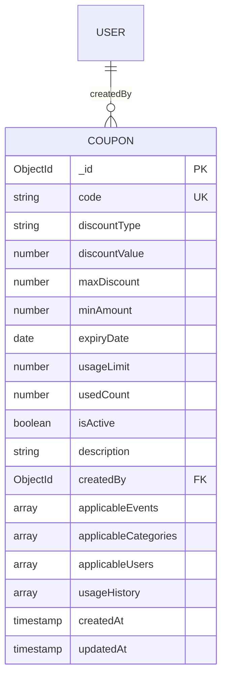

**Diagram sources**
- [couponSchema.js:3-98](file://backend/models/couponSchema.js#L3-L98)
- [userSchema.js:4-52](file://backend/models/userSchema.js#L4-L52)

**Section sources**
- [couponSchema.js:3-98](file://backend/models/couponSchema.js#L3-L98)
- [userSchema.js:4-52](file://backend/models/userSchema.js#L4-L52)

### Follows
- Schema highlights: user, merchant.
- Validation: References User for both fields.
- Indexes: Unique compound index on user + merchant.
- Relationships: Both sides reference User.

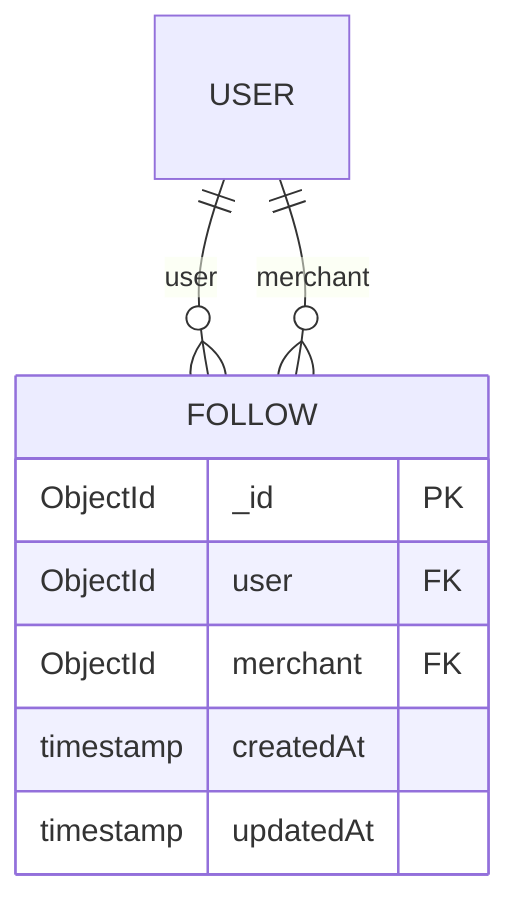

**Diagram sources**
- [followSchema.js:3-21](file://backend/models/followSchema.js#L3-L21)
- [userSchema.js:4-52](file://backend/models/userSchema.js#L4-L52)

**Section sources**
- [followSchema.js:3-21](file://backend/models/followSchema.js#L3-L21)
- [userSchema.js:4-52](file://backend/models/userSchema.js#L4-L52)

### Reviews
- Schema highlights: user, event, rating, reviewText.
- Validation: Rating bounds, uniqueness constraint on user + event.
- Indexes: Unique compound index on user + event.
- Relationships: Links User and Event.

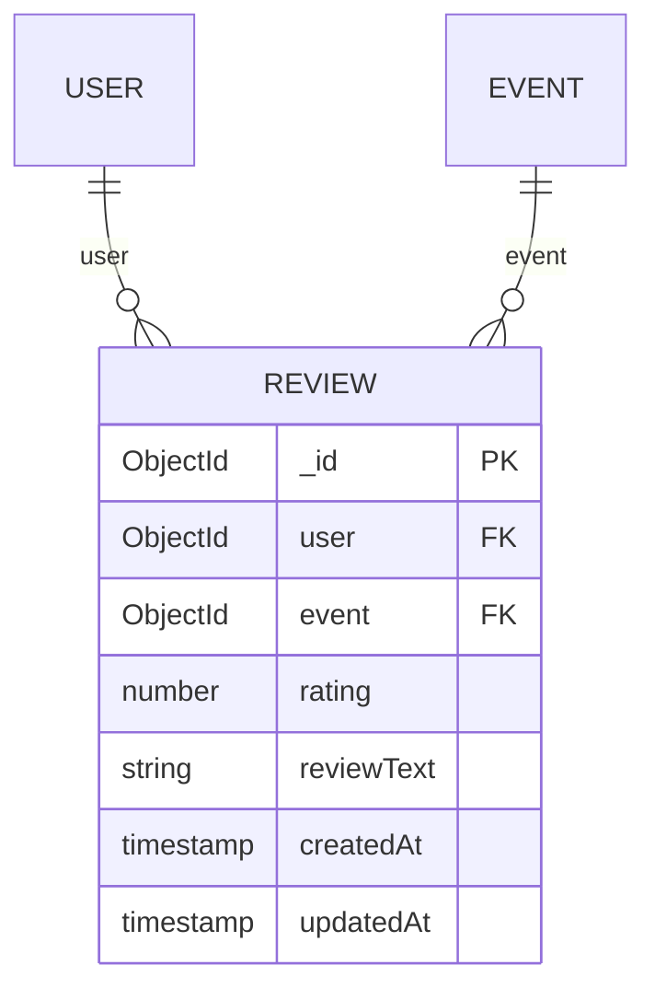

**Diagram sources**
- [reviewSchema.js:3-11](file://backend/models/reviewSchema.js#L3-L11)
- [userSchema.js:4-52](file://backend/models/userSchema.js#L4-L52)
- [eventSchema.js:3-20](file://backend/models/eventSchema.js#L3-L20)

**Section sources**
- [reviewSchema.js:3-11](file://backend/models/reviewSchema.js#L3-L11)
- [userSchema.js:4-52](file://backend/models/userSchema.js#L4-L52)
- [eventSchema.js:3-20](file://backend/models/eventSchema.js#L3-L20)

### Ratings
- Schema highlights: user, event, rating.
- Validation: Rating bounds, uniqueness constraint on user + event.
- Indexes: Unique compound index on user + event.
- Relationships: Links User and Event.

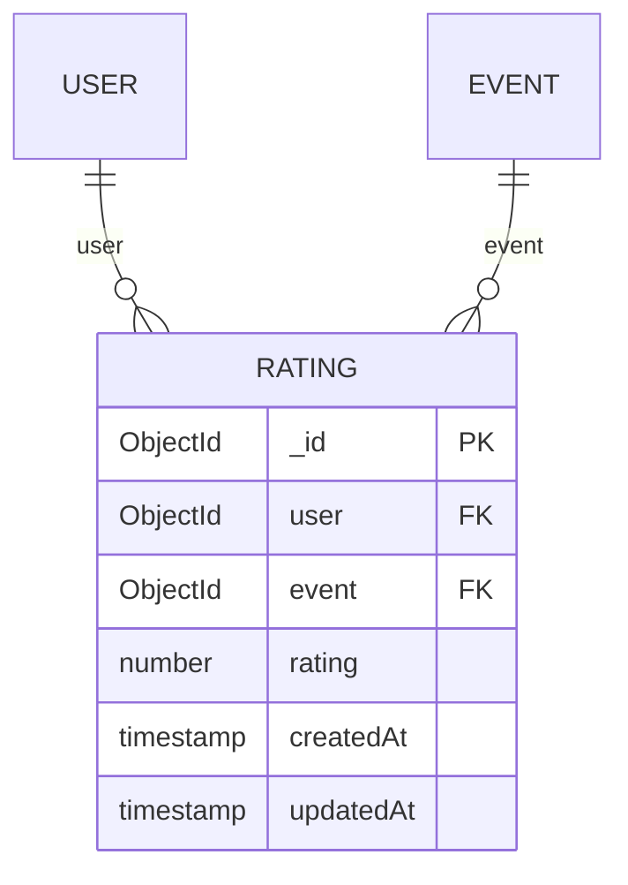

**Diagram sources**
- [ratingSchema.js:3-23](file://backend/models/ratingSchema.js#L3-L23)
- [userSchema.js:4-52](file://backend/models/userSchema.js#L4-L52)
- [eventSchema.js:3-20](file://backend/models/eventSchema.js#L3-L20)

**Section sources**
- [ratingSchema.js:3-23](file://backend/models/ratingSchema.js#L3-L23)
- [userSchema.js:4-52](file://backend/models/userSchema.js#L4-L52)
- [eventSchema.js:3-20](file://backend/models/eventSchema.js#L3-L20)

### Notifications
- Schema highlights: user, message, read, eventId, bookingId, type.
- Validation: Enum for type, references for user and bookingId.
- Indexes: Consider user + createdAt, read.
- Relationships: Links User; optionally links Booking.

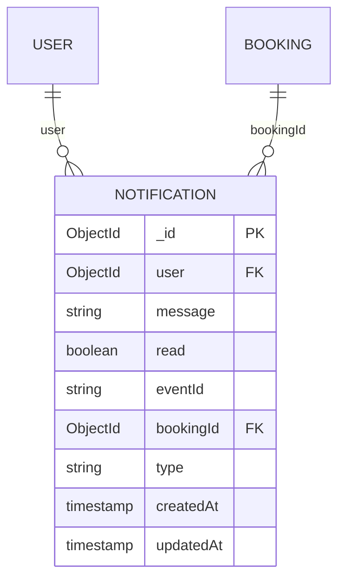

**Diagram sources**
- [notificationSchema.js:3-33](file://backend/models/notificationSchema.js#L3-L33)
- [userSchema.js:4-52](file://backend/models/userSchema.js#L4-L52)
- [bookingSchema.js:3-50](file://backend/models/bookingSchema.js#L3-L50)

**Section sources**
- [notificationSchema.js:3-33](file://backend/models/notificationSchema.js#L3-L33)
- [userSchema.js:4-52](file://backend/models/userSchema.js#L4-L52)
- [bookingSchema.js:3-50](file://backend/models/bookingSchema.js#L3-L50)

### Payments
- Schema highlights: userId, merchantId, bookingId, eventId, amounts, commission percent, status, paymentMethod, transactionId (unique), gateway, refund fields, payout fields, currency, description, metadata.
- Validation: Amounts validated via pre-save middleware, enums for status and method, unique transactionId.
- Indexes: Composite indexes on userId/merchantId + createdAt, bookingId, transactionId, paymentStatus.
- Middleware: Pre-save amount validation.
- Relationships: Links User (userId, merchantId), Booking, Event.

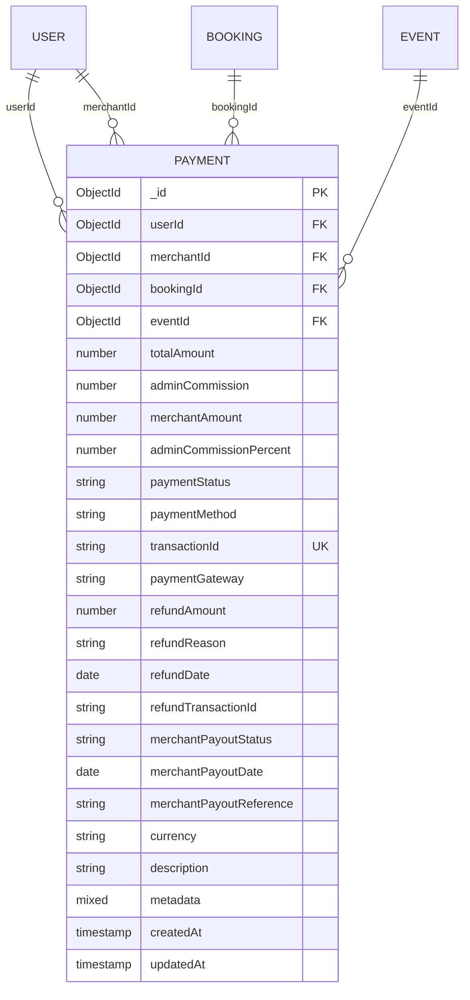

**Diagram sources**
- [paymentSchema.js:3-109](file://backend/models/paymentSchema.js#L3-L109)
- [userSchema.js:4-52](file://backend/models/userSchema.js#L4-L52)
- [bookingSchema.js:3-50](file://backend/models/bookingSchema.js#L3-L50)
- [eventSchema.js:3-20](file://backend/models/eventSchema.js#L3-L20)

**Section sources**
- [paymentSchema.js:3-109](file://backend/models/paymentSchema.js#L3-L109)
- [userSchema.js:4-52](file://backend/models/userSchema.js#L4-L52)
- [bookingSchema.js:3-50](file://backend/models/bookingSchema.js#L3-L50)
- [eventSchema.js:3-20](file://backend/models/eventSchema.js#L3-L20)

### Registrations
- Schema highlights: user, event.
- Relationships: Links User and Event.

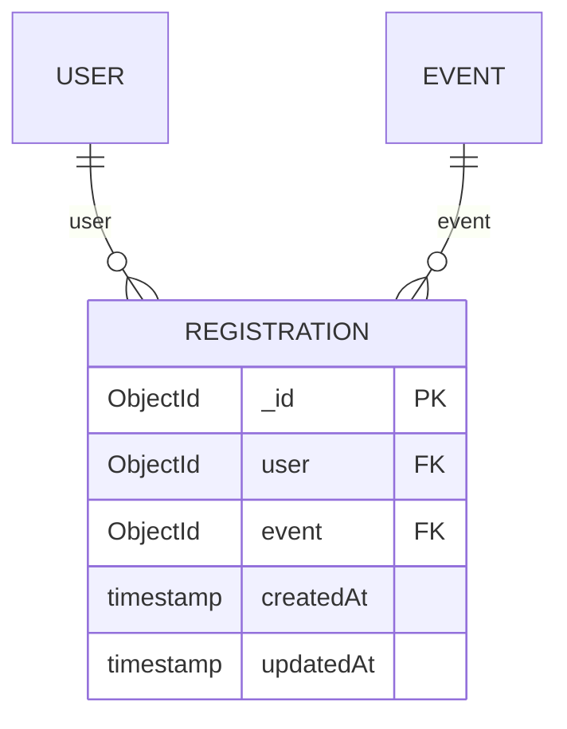

**Diagram sources**
- [registrationSchema.js:3-9](file://backend/models/registrationSchema.js#L3-L9)
- [userSchema.js:4-52](file://backend/models/userSchema.js#L4-L52)
- [eventSchema.js:3-20](file://backend/models/eventSchema.js#L3-L20)

**Section sources**
- [registrationSchema.js:3-9](file://backend/models/registrationSchema.js#L3-L9)
- [userSchema.js:4-52](file://backend/models/userSchema.js#L4-L52)
- [eventSchema.js:3-20](file://backend/models/eventSchema.js#L3-L20)

### Messages
- Schema highlights: name, email, subject, message.
- Validation: Length and format checks.
- Relationships: No relational references.

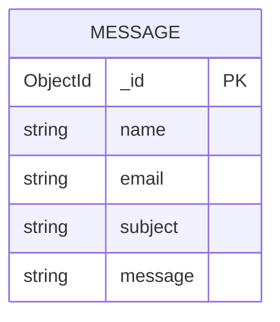

**Diagram sources**
- [messageSchema.js:4-25](file://backend/models/messageSchema.js#L4-L25)

**Section sources**
- [messageSchema.js:4-25](file://backend/models/messageSchema.js#L4-L25)

## Dependency Analysis
The following diagram shows inter-collection dependencies inferred from schema references and relationships documented above.

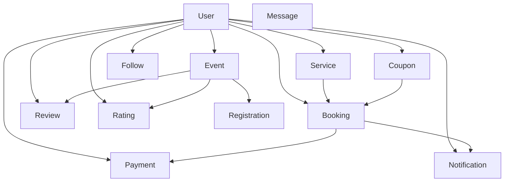

**Diagram sources**
- [userSchema.js:4-52](file://backend/models/userSchema.js#L4-L52)
- [eventSchema.js:3-20](file://backend/models/eventSchema.js#L3-L20)
- [bookingSchema.js:3-50](file://backend/models/bookingSchema.js#L3-L50)
- [serviceSchema.js:14-77](file://backend/models/serviceSchema.js#L14-L77)
- [couponSchema.js:3-98](file://backend/models/couponSchema.js#L3-L98)
- [followSchema.js:3-21](file://backend/models/followSchema.js#L3-L21)
- [reviewSchema.js:3-11](file://backend/models/reviewSchema.js#L3-L11)
- [ratingSchema.js:3-23](file://backend/models/ratingSchema.js#L3-L23)
- [notificationSchema.js:3-33](file://backend/models/notificationSchema.js#L3-L33)
- [paymentSchema.js:3-109](file://backend/models/paymentSchema.js#L3-L109)
- [registrationSchema.js:3-9](file://backend/models/registrationSchema.js#L3-L9)
- [messageSchema.js:4-25](file://backend/models/messageSchema.js#L4-L25)

**Section sources**
- [userSchema.js:4-52](file://backend/models/userSchema.js#L4-L52)
- [eventSchema.js:3-20](file://backend/models/eventSchema.js#L3-L20)
- [bookingSchema.js:3-50](file://backend/models/bookingSchema.js#L3-L50)
- [serviceSchema.js:14-77](file://backend/models/serviceSchema.js#L14-L77)
- [couponSchema.js:3-98](file://backend/models/couponSchema.js#L3-L98)
- [followSchema.js:3-21](file://backend/models/followSchema.js#L3-L21)
- [reviewSchema.js:3-11](file://backend/models/reviewSchema.js#L3-L11)
- [ratingSchema.js:3-23](file://backend/models/ratingSchema.js#L3-L23)
- [notificationSchema.js:3-33](file://backend/models/notificationSchema.js#L3-L33)
- [paymentSchema.js:3-109](file://backend/models/paymentSchema.js#L3-L109)
- [registrationSchema.js:3-9](file://backend/models/registrationSchema.js#L3-L9)
- [messageSchema.js:4-25](file://backend/models/messageSchema.js#L4-L25)

## Performance Considerations
- Indexing strategy
  - Services: Full-text index on title, description, category to support search.
  - Coupons: Unique index on code, composite index on isActive + expiryDate, index on createdBy.
  - Payments: Composite indexes on userId + createdAt (descending), merchantId + createdAt (descending), bookingId, transactionId, paymentStatus.
  - Reviews/Ratings: Unique compound index on user + event to prevent duplicates.
  - Follows: Unique compound index on user + merchant to prevent duplicate follow relationships.
  - Notifications: Consider indexes on user + createdAt and read for efficient pagination and filtering.
  - Users: Consider a unique index on email for fast authentication and lookup.
- Query optimization
  - Use lean queries and selective projections to reduce payload size.
  - Prefer compound indexes aligned with common filter/sort patterns (e.g., user + createdAt).
  - Avoid N+1 queries by populating references judiciously and batching operations.
- Connection and reliability
  - The connection module retries multiple strategies and uses forced DNS to resolve SRV records reliably.
  - Mongoose options include timeouts, pool size, retry writes, and write concern for durability.
- Data validation
  - Pre-save middleware ensures amount correctness in Payments and normalizes Coupon codes to uppercase.
- Storage and embedding
  - Embedded arrays (images, features) keep related data close; consider capped arrays where appropriate.
  - References are used for denormalization boundaries (e.g., user references) to avoid document growth issues.

[No sources needed since this section provides general guidance]

## Troubleshooting Guide
- MongoDB Atlas connectivity
  - The connection module implements three strategies: SRV URI with forced DNS, manual SRV resolution, and direct shard hostnames. It logs detailed failures and exits with actionable steps if all attempts fail.
  - Recommended checklist includes verifying network access (allowing 0.0.0.0/0), confirming cluster activity, validating credentials, and testing DNS resolution.
- Setup and permanent solutions
  - Follow the Atlas setup guide and permanent solution documents for environment configuration and long-term stability.
- Local development vs Atlas
  - The connection module does not fall back to a local database on failure; ensure Atlas is reachable and configured correctly.

**Section sources**
- [dbConnection.js:19-94](file://backend/database/dbConnection.js#L19-L94)
- [MONGODB_ATLAS_SETUP_GUIDE.md](file://backend/MONGODB_ATLAS_SETUP_GUIDE.md)
- [MONGODB_ATLAS_PERMANENT_SOLUTION.md](file://backend/MONGODB_ATLAS_PERMANENT_SOLUTION.md)
- [DATABASE_TROUBLESHOOTING.md](file://backend/DATABASE_TROUBLESHOOTING.md)

## Conclusion
The database design for the MERN Stack Event Management Platform emphasizes clear entity relationships, strong validation, and targeted indexing to support search, payments, and user interactions. The connection module ensures reliable access to MongoDB Atlas with multiple fallback strategies and DNS overrides. By following the indexing and query optimization recommendations and leveraging the provided troubleshooting resources, the platform can maintain performance and scalability as it evolves.

[No sources needed since this section summarizes without analyzing specific files]

## Appendices

### A. Collection Indexes Summary
- Services: Text index on title, description, category
- Coupons: Unique code, composite isActive + expiryDate, createdBy
- Payments: Composite userId + createdAt(desc), merchantId + createdAt(desc), bookingId, transactionId, paymentStatus
- Reviews: Unique user + event
- Ratings: Unique user + event
- Follows: Unique user + merchant
- Notifications: Consider user + createdAt, read
- Users: Consider unique email

**Section sources**
- [serviceSchema.js:79-80](file://backend/models/serviceSchema.js#L79-L80)
- [couponSchema.js:110-113](file://backend/models/couponSchema.js#L110-L113)
- [paymentSchema.js:122-127](file://backend/models/paymentSchema.js#L122-L127)
- [reviewSchema.js:13-14](file://backend/models/reviewSchema.js#L13-L14)
- [ratingSchema.js:25-26](file://backend/models/ratingSchema.js#L25-L26)
- [followSchema.js:19-20](file://backend/models/followSchema.js#L19-L20)
- [notificationSchema.js:3-33](file://backend/models/notificationSchema.js#L3-L33)
- [userSchema.js:26-31](file://backend/models/userSchema.js#L26-L31)

### B. Sample Data Structures
- Users
  - Fields: name, businessName, phone, serviceType, email, password, role, status
  - Example: { name: "...", email: "...", role: "user|merchant|admin", status: "active|inactive", ... }
- Events
  - Fields: title, description, category, price, rating, images[], features[], createdBy
  - Example: { title: "...", category: "...", price: 0, rating: 0..5, images: [{ public_id: "...", url: "..." }], features: [...], createdBy: ObjectId, ... }
- Bookings
  - Fields: user, serviceId, serviceTitle, serviceCategory, servicePrice, bookingDate, eventDate, notes, status, guestCount, totalPrice
  - Example: { user: ObjectId, serviceId: "...", status: "pending|confirmed|cancelled|completed", totalPrice: 0, ... }
- Services
  - Fields: title, description, category, price, rating, images[], isActive, createdBy
  - Example: { title: "...", category: "wedding|corporate|...", price: 0, rating: 0..5, images: [...], isActive: true, createdBy: ObjectId, ... }
- Coupons
  - Fields: code, discountType, discountValue, maxDiscount, minAmount, expiryDate, usageLimit, usedCount, isActive, description, createdBy, applicableEvents[], applicableCategories[], applicableUsers[], usageHistory[]
  - Example: { code: "...", discountType: "percentage|flat", discountValue: 0, expiryDate: Date, usageLimit: 1, usedCount: 0, ... }
- Follows
  - Fields: user, merchant
  - Example: { user: ObjectId, merchant: ObjectId }
- Reviews
  - Fields: user, event, rating, reviewText
  - Example: { user: ObjectId, event: ObjectId, rating: 1..5, reviewText: "..." }
- Ratings
  - Fields: user, event, rating
  - Example: { user: ObjectId, event: ObjectId, rating: 1..5 }
- Notifications
  - Fields: user, message, read, eventId, bookingId, type
  - Example: { user: ObjectId, message: "...", type: "booking|payment|general", ... }
- Payments
  - Fields: userId, merchantId, bookingId, eventId, totalAmount, adminCommission, merchantAmount, adminCommissionPercent, paymentStatus, paymentMethod, transactionId, paymentGateway, refund fields, merchant payout fields, currency, description, metadata
  - Example: { totalAmount: 0, adminCommission: 0, merchantAmount: 0, paymentStatus: "pending|success|failed|refunded", paymentMethod: "UPI|Card|NetBanking|Cash|Wallet", transactionId: "...", ... }
- Registrations
  - Fields: user, event
  - Example: { user: ObjectId, event: ObjectId }
- Messages
  - Fields: name, email, subject, message
  - Example: { name: "...", email: "...", subject: "...", message: "..." }

**Section sources**
- [userSchema.js:4-52](file://backend/models/userSchema.js#L4-L52)
- [eventSchema.js:3-20](file://backend/models/eventSchema.js#L3-L20)
- [bookingSchema.js:3-50](file://backend/models/bookingSchema.js#L3-L50)
- [serviceSchema.js:14-77](file://backend/models/serviceSchema.js#L14-L77)
- [couponSchema.js:3-98](file://backend/models/couponSchema.js#L3-L98)
- [followSchema.js:3-21](file://backend/models/followSchema.js#L3-L21)
- [reviewSchema.js:3-11](file://backend/models/reviewSchema.js#L3-L11)
- [ratingSchema.js:3-23](file://backend/models/ratingSchema.js#L3-L23)
- [notificationSchema.js:3-33](file://backend/models/notificationSchema.js#L3-L33)
- [paymentSchema.js:3-109](file://backend/models/paymentSchema.js#L3-L109)
- [registrationSchema.js:3-9](file://backend/models/registrationSchema.js#L3-L9)
- [messageSchema.js:4-25](file://backend/models/messageSchema.js#L4-L25)

### C. Migration Procedures
- Local to Atlas
  - Prepare environment variables and credentials as configured in the connection module.
  - Use the provided scripts to migrate data from a local database to Atlas if applicable.
  - Validate connectivity using the Atlas connection script and confirm collections are created.
- Data seeding
  - Use seed scripts to populate initial data for services, events, and users as needed.
- Backup and restore
  - Use Atlas backup features and restore procedures to safeguard data during migrations.

**Section sources**
- [dbConnection.js:19-94](file://backend/database/dbConnection.js#L19-L94)
- [DATABASE_SETUP.md](file://backend/DATABASE_SETUP.md)
- [MONGODB_ATLAS_SETUP_GUIDE.md](file://backend/MONGODB_ATLAS_SETUP_GUIDE.md)
- [MONGODB_ATLAS_PERMANENT_SOLUTION.md](file://backend/MONGODB_ATLAS_PERMANENT_SOLUTION.md)