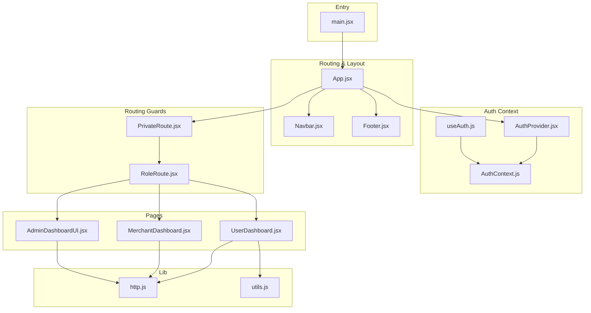
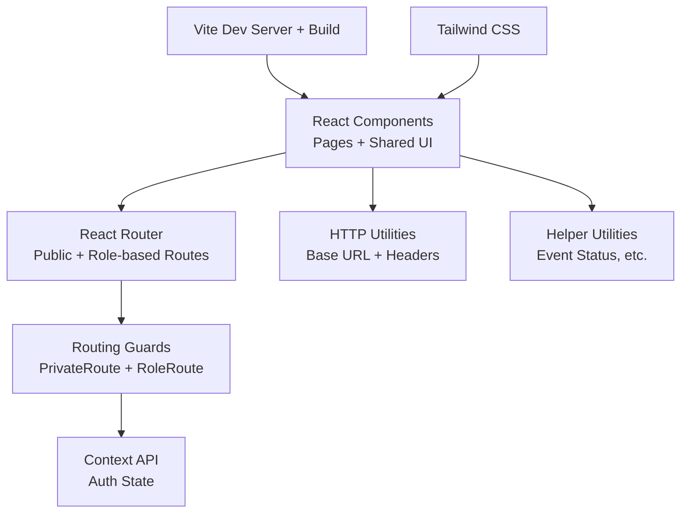
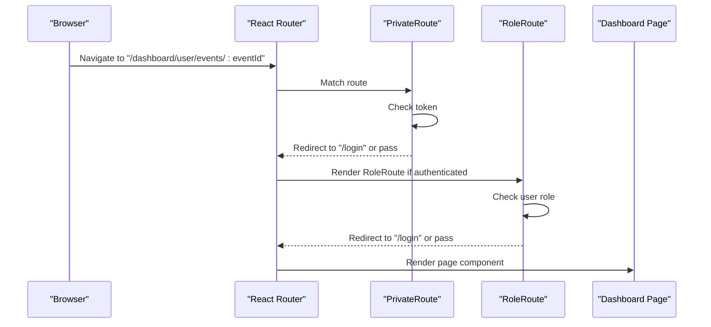
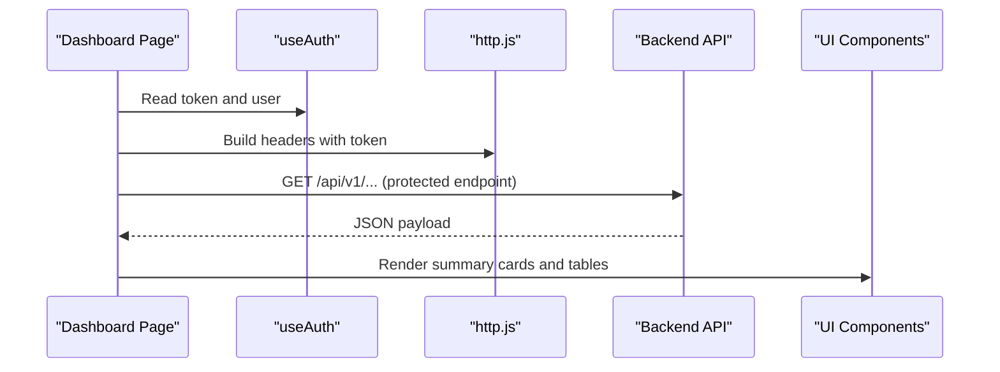
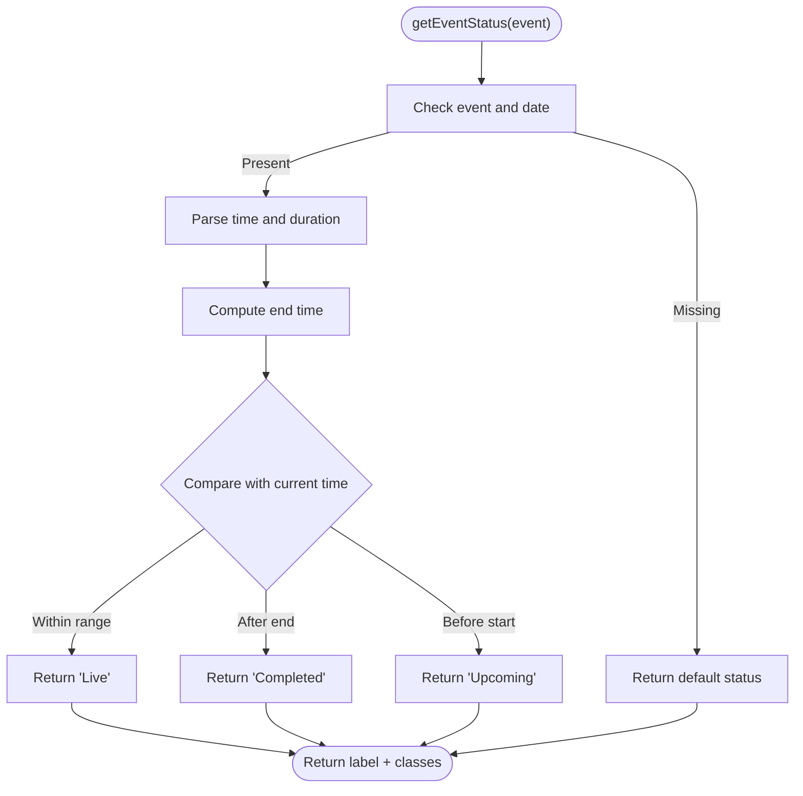
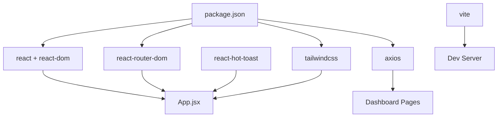

# Frontend Architecture

<cite>
**Referenced Files in This Document**
- [main.jsx](file://frontend/src/main.jsx)
- [App.jsx](file://frontend/src/App.jsx)
- [Navbar.jsx](file://frontend/src/components/Navbar.jsx)
- [Footer.jsx](file://frontend/src/components/Footer.jsx)
- [AuthProvider.jsx](file://frontend/src/context/AuthProvider.jsx)
- [useAuth.js](file://frontend/src/context/useAuth.js)
- [AuthContext.js](file://frontend/src/context/AuthContext.js)
- [PrivateRoute.jsx](file://frontend/src/components/PrivateRoute.jsx)
- [RoleRoute.jsx](file://frontend/src/components/RoleRoute.jsx)
- [AdminDashboardUI.jsx](file://frontend/src/pages/dashboards/AdminDashboardUI.jsx)
- [UserDashboard.jsx](file://frontend/src/pages/dashboards/UserDashboard.jsx)
- [MerchantDashboard.jsx](file://frontend/src/pages/dashboards/MerchantDashboard.jsx)
- [http.js](file://frontend/src/lib/http.js)
- [utils.js](file://frontend/src/lib/utils.js)
- [vite.config.js](file://frontend/vite.config.js)
- [package.json](file://frontend/package.json)
- [tailwind.config.js](file://frontend/tailwind.config.js)
</cite>

## Table of Contents
1. [Introduction](#introduction)
2. [Project Structure](#project-structure)
3. [Core Components](#core-components)
4. [Architecture Overview](#architecture-overview)
5. [Detailed Component Analysis](#detailed-component-analysis)
6. [Dependency Analysis](#dependency-analysis)
7. [Performance Considerations](#performance-considerations)
8. [Troubleshooting Guide](#troubleshooting-guide)
9. [Conclusion](#conclusion)
10. [Appendices](#appendices)

## Introduction
This document describes the frontend architecture of the React-based user interface for the MERN stack event project. It covers component hierarchy, routing with React Router, state management via the Context API, and styling with Tailwind CSS. It also documents the main application layout, reusable component patterns, role-based UI rendering, component composition, prop drilling solutions, state synchronization, build configuration with Vite, development workflow, and deployment considerations. Finally, it provides guidelines for component development, styling consistency, and performance optimization.

## Project Structure
The frontend is organized around a clear separation of concerns:
- Entry point initializes the React root and global styles.
- App wraps the routing tree and provides the authentication context.
- Routing defines public pages and protected dashboards segmented by roles.
- Pages implement role-specific dashboards and feature screens.
- Components encapsulate shared UI (layout, navigation, modals).
- Context manages authentication state and exposes a hook for consumption.
- Utilities centralize HTTP base URLs and headers, and helper functions for UI logic.
- Build and styling are configured via Vite and Tailwind CSS.



**Diagram sources**
- [main.jsx:1-11](file://frontend/src/main.jsx#L1-L11)
- [App.jsx:1-373](file://frontend/src/App.jsx#L1-L373)
- [Navbar.jsx:1-60](file://frontend/src/components/Navbar.jsx#L1-L60)
- [Footer.jsx:1-58](file://frontend/src/components/Footer.jsx#L1-L58)
- [AuthProvider.jsx:1-38](file://frontend/src/context/AuthProvider.jsx#L1-L38)
- [useAuth.js](file://frontend/src/context/useAuth.js)
- [AuthContext.js](file://frontend/src/context/AuthContext.js)
- [PrivateRoute.jsx:1-15](file://frontend/src/components/PrivateRoute.jsx#L1-L15)
- [RoleRoute.jsx:1-16](file://frontend/src/components/RoleRoute.jsx#L1-L16)
- [UserDashboard.jsx:1-249](file://frontend/src/pages/dashboards/UserDashboard.jsx#L1-L249)
- [MerchantDashboard.jsx:1-133](file://frontend/src/pages/dashboards/MerchantDashboard.jsx#L1-L133)
- [AdminDashboardUI.jsx:1-124](file://frontend/src/pages/dashboards/AdminDashboardUI.jsx#L1-L124)
- [http.js:1-5](file://frontend/src/lib/http.js#L1-L5)
- [utils.js:1-26](file://frontend/src/lib/utils.js#L1-L26)

**Section sources**
- [main.jsx:1-11](file://frontend/src/main.jsx#L1-L11)
- [App.jsx:1-373](file://frontend/src/App.jsx#L1-L373)

## Core Components
- Application shell and routing:
  - App sets up the Router, global toast notifications, and routes for public pages and role-based dashboards. It conditionally hides the navbar/footer inside dashboards using location detection.
- Authentication context:
  - AuthProvider stores token and user in state and local storage, exposes login/logout, and provides a context value.
  - useAuth is a convenience hook to consume the context.
- Routing guards:
  - PrivateRoute enforces authentication by redirecting unauthenticated users to login.
  - RoleRoute enforces role-based access by checking user role and redirecting otherwise.
- Shared layout components:
  - Navbar and Footer provide consistent branding and navigation across public pages.
- Dashboard pages:
  - UserDashboard, MerchantDashboard, and AdminDashboardUI implement role-specific UIs, loading data, and rendering summary cards and tables.

Key implementation patterns:
- Composition: App composes AuthProvider, Router, and routes; routes compose PrivateRoute and RoleRoute to protect pages.
- Context API: Centralized authentication state avoids prop drilling across nested routes.
- Utility functions: Helper functions encapsulate UI logic (e.g., event status calculation) and HTTP configuration.

**Section sources**
- [App.jsx:51-373](file://frontend/src/App.jsx#L51-L373)
- [AuthProvider.jsx:1-38](file://frontend/src/context/AuthProvider.jsx#L1-L38)
- [useAuth.js](file://frontend/src/context/useAuth.js)
- [AuthContext.js](file://frontend/src/context/AuthContext.js)
- [PrivateRoute.jsx:1-15](file://frontend/src/components/PrivateRoute.jsx#L1-L15)
- [RoleRoute.jsx:1-16](file://frontend/src/components/RoleRoute.jsx#L1-L16)
- [Navbar.jsx:1-60](file://frontend/src/components/Navbar.jsx#L1-L60)
- [Footer.jsx:1-58](file://frontend/src/components/Footer.jsx#L1-L58)
- [UserDashboard.jsx:1-249](file://frontend/src/pages/dashboards/UserDashboard.jsx#L1-L249)
- [MerchantDashboard.jsx:1-133](file://frontend/src/pages/dashboards/MerchantDashboard.jsx#L1-L133)
- [AdminDashboardUI.jsx:1-124](file://frontend/src/pages/dashboards/AdminDashboardUI.jsx#L1-L124)

## Architecture Overview
The frontend follows a layered architecture:
- Presentation layer: React components (pages and shared components).
- Routing layer: React Router with nested routes and guards.
- State layer: Context API for authentication state.
- Service layer: HTTP utilities and helper functions.
- Build layer: Vite for dev server and bundling; Tailwind for styling.



[No sources needed since this diagram shows conceptual architecture, not a direct code mapping]

## Detailed Component Analysis

### Authentication Context and Hooks
The authentication context provides centralized state for token and user, persists to local storage, and exposes login/logout actions. The useAuth hook simplifies consuming context in components.

```mermaid
classDiagram
class AuthProvider {
+state token
+state user
+login(t, u)
+logout()
}
class AuthContext {
+value token
+value user
}
class useAuth {
+returns {token, user, login, logout}
}
AuthProvider --> AuthContext : "provides"
useAuth --> AuthContext : "consumes"
```

**Diagram sources**
- [AuthProvider.jsx:1-38](file://frontend/src/context/AuthProvider.jsx#L1-L38)
- [AuthContext.js](file://frontend/src/context/AuthContext.js)
- [useAuth.js](file://frontend/src/context/useAuth.js)

**Section sources**
- [AuthProvider.jsx:1-38](file://frontend/src/context/AuthProvider.jsx#L1-L38)
- [useAuth.js](file://frontend/src/context/useAuth.js)
- [AuthContext.js](file://frontend/src/context/AuthContext.js)

### Routing and Role-Based Access
The routing tree defines public pages and role-based dashboards. PrivateRoute ensures only authenticated users can access protected routes. RoleRoute enforces role checks.



**Diagram sources**
- [App.jsx:76-348](file://frontend/src/App.jsx#L76-L348)
- [PrivateRoute.jsx:1-15](file://frontend/src/components/PrivateRoute.jsx#L1-L15)
- [RoleRoute.jsx:1-16](file://frontend/src/components/RoleRoute.jsx#L1-L16)

**Section sources**
- [App.jsx:76-348](file://frontend/src/App.jsx#L76-L348)
- [PrivateRoute.jsx:1-15](file://frontend/src/components/PrivateRoute.jsx#L1-L15)
- [RoleRoute.jsx:1-16](file://frontend/src/components/RoleRoute.jsx#L1-L16)

### Dashboard Pages and Data Loading
Each dashboard page loads data using Axios with authenticated headers and renders summaries and tables. They rely on the shared layout components and context for authentication.



**Diagram sources**
- [UserDashboard.jsx:27-50](file://frontend/src/pages/dashboards/UserDashboard.jsx#L27-L50)
- [MerchantDashboard.jsx:19-25](file://frontend/src/pages/dashboards/MerchantDashboard.jsx#L19-L25)
- [AdminDashboardUI.jsx:17-31](file://frontend/src/pages/dashboards/AdminDashboardUI.jsx#L17-L31)
- [http.js:1-5](file://frontend/src/lib/http.js#L1-L5)

**Section sources**
- [UserDashboard.jsx:1-249](file://frontend/src/pages/dashboards/UserDashboard.jsx#L1-L249)
- [MerchantDashboard.jsx:1-133](file://frontend/src/pages/dashboards/MerchantDashboard.jsx#L1-L133)
- [AdminDashboardUI.jsx:1-124](file://frontend/src/pages/dashboards/AdminDashboardUI.jsx#L1-L124)
- [http.js:1-5](file://frontend/src/lib/http.js#L1-L5)

### Event Status Utility
A helper computes event status labels and classes based on date/time and duration, enabling consistent UI rendering across dashboards.



**Diagram sources**
- [utils.js:6-25](file://frontend/src/lib/utils.js#L6-L25)

**Section sources**
- [utils.js:1-26](file://frontend/src/lib/utils.js#L1-L26)

## Dependency Analysis
External dependencies and build configuration:
- React and React Router DOM power the UI and routing.
- Axios handles HTTP requests.
- Tailwind CSS provides utility-first styling.
- Vite builds and serves the app locally.



**Diagram sources**
- [package.json:12-36](file://frontend/package.json#L12-L36)
- [vite.config.js:1-12](file://frontend/vite.config.js#L1-L12)
- [App.jsx:1-373](file://frontend/src/App.jsx#L1-L373)

**Section sources**
- [package.json:12-36](file://frontend/package.json#L12-L36)
- [vite.config.js:1-12](file://frontend/vite.config.js#L1-L12)

## Performance Considerations
- Minimize re-renders:
  - Use memoization for callbacks passed to effects and event handlers (e.g., useCallback).
  - Keep heavy computations in helpers (e.g., event status) outside render paths.
- Efficient data fetching:
  - Batch requests with Promise.all where appropriate.
  - Avoid unnecessary polling; leverage route changes and user actions.
- Rendering optimization:
  - Use CSS grid/flex utilities for responsive layouts without extra wrappers.
  - Prefer lightweight components and avoid deep nesting.
- Bundle size:
  - Keep third-party libraries minimal and scoped.
  - Use Tailwind’s purge configuration to remove unused styles.

[No sources needed since this section provides general guidance]

## Troubleshooting Guide
Common issues and resolutions:
- Authentication redirects loop:
  - Ensure token and user are persisted in local storage and hydrated on startup.
  - Verify PrivateRoute and RoleRoute receive the correct context values.
- Dashboard data not loading:
  - Confirm auth token is present and headers are constructed properly.
  - Check network tab for 401/403 responses indicating missing or invalid token.
- Styling inconsistencies:
  - Verify Tailwind content paths include all JSX files.
  - Ensure darkMode and theme extensions are configured as needed.

**Section sources**
- [AuthProvider.jsx:9-28](file://frontend/src/context/AuthProvider.jsx#L9-L28)
- [PrivateRoute.jsx:5-9](file://frontend/src/components/PrivateRoute.jsx#L5-L9)
- [RoleRoute.jsx:5-9](file://frontend/src/components/RoleRoute.jsx#L5-L9)
- [http.js:1-5](file://frontend/src/lib/http.js#L1-L5)
- [tailwind.config.js:1-10](file://frontend/tailwind.config.js#L1-L10)

## Conclusion
The frontend employs a clean, layered architecture with React Router for routing, Context API for authentication state, and Tailwind CSS for styling. Role-based access is enforced through composed guards, and dashboards fetch and render data efficiently. The Vite build pipeline supports a smooth development workflow, and the modular structure encourages maintainability and scalability.

[No sources needed since this section summarizes without analyzing specific files]

## Appendices

### Build Configuration with Vite
- Development server runs on port 5173 with host enabled.
- React plugin powered by @vitejs/plugin-react-swc.
- Scripts include dev, build, lint, and preview.

**Section sources**
- [vite.config.js:1-12](file://frontend/vite.config.js#L1-L12)
- [package.json:6-11](file://frontend/package.json#L6-L11)

### Styling Approach with Tailwind CSS
- Content paths include index.html and all JSX under src.
- Dark mode is configured via class strategy.
- Theme extensions can be added as needed.

**Section sources**
- [tailwind.config.js:1-10](file://frontend/tailwind.config.js#L1-L10)

### Component Development Guidelines
- Keep components small and single-responsibility.
- Centralize cross-cutting concerns (auth, HTTP) in hooks and utilities.
- Use TypeScript-compatible PropTypes for runtime safety where applicable.
- Prefer composition over inheritance; wrap pages with layout components.
- Maintain consistent spacing and typography using Tailwind utilities.

[No sources needed since this section provides general guidance]

### State Synchronization Between Components
- Use the AuthProvider context to synchronize authentication state across the app.
- For dashboard data, fetch once per route and derive computed values in memory.
- For UI state toggles (modals, forms), keep state close to the component that controls it.

[No sources needed since this section provides general guidance]